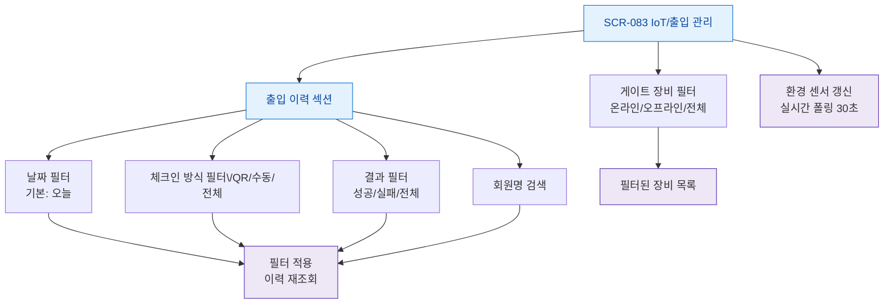

## 다이어그램

```mermaid
flowchart TD
    SCR083[SCR-083 IoT/출입 관리]

    SCR083 --> LogSection[출입 이력 섹션]
    LogSection --> DateFilter[날짜 필터\n기본: 오늘]
    LogSection --> MethodFilter[체크인 방식 필터\/QR/수동/전체]
    LogSection --> ResultFilter[결과 필터\n성공/실패/전체]
    LogSection --> SearchMember[회원명 검색]

    DateFilter & MethodFilter & ResultFilter & SearchMember --> FilterApply[필터 적용\n이력 재조회]

    SCR083 --> GateFilter[게이트 장비 필터\n온라인/오프라인/전체]
    GateFilter --> GateList[필터된 장비 목록]

    SCR083 --> EnvRefresh[환경 센서 갱신\n실시간 폴링 30초]

    classDef screen fill:#E3F2FD,stroke:#1976D2,color:#0D47A1
    classDef system fill:#EDE7F6,stroke:#5E35B2
    class SCR083,LogSection screen
    class FilterApply,GateList,EnvRefresh system
```

## TC 후보
- TC-083-005: 출입 이력 방식 필터 "RFID" → RFID만 표시
- TC-083-006: 결과 필터 "실패" → 실패 이력만 표시
