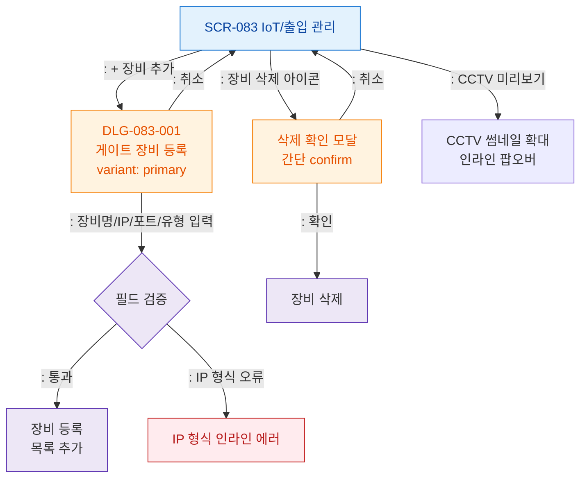

## 다이어그램

```mermaid
flowchart TD
    SCR083[SCR-083 IoT/출입 관리]

    SCR083 -->|": + 장비 추가"|DLG_001[DLG-083-001\n게이트 장비 등록\nvariant: primary]
    DLG_001 -->|": 장비명/IP/포트/유형 입력"|Validate{필드 검증}
    Validate -->|": 통과"|AddDevice[장비 등록\n목록 추가]
    Validate -->|": IP 형식 오류"|IPError[IP 형식 인라인 에러]
    DLG_001 -->|": 취소"|SCR083

    SCR083 -->|": 장비 삭제 아이콘"|DLG_DEL[삭제 확인 모달\n간단 confirm]
    DLG_DEL -->|": 확인"|DeleteDevice[장비 삭제]
    DLG_DEL -->|": 취소"|SCR083

    SCR083 -->|": CCTV 미리보기"|CCTVPreview[CCTV 썸네일 확대\n인라인 팝오버]

    classDef screen fill:#E3F2FD,stroke:#1976D2,color:#0D47A1
    classDef modal fill:#FFF3E0,stroke:#F57C00,color:#E65100
    classDef error fill:#FFEBEE,stroke:#C62828,color:#B71C1C
    classDef system fill:#EDE7F6,stroke:#5E35B2
    class SCR083 screen
    class DLG_001,DLG_DEL modal
    class IPError error
    class Validate,AddDevice,DeleteDevice system
```

## TC 후보
- TC-083-002: + 장비 추가 → DLG-083-001 → 저장 → 목록 추가
- TC-083-NEG-002: IP 형식 오류 → 인라인 에러
