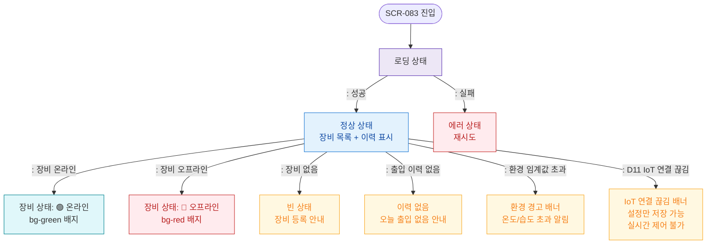

## 다이어그램

```mermaid
flowchart TD
    Entry([SCR-083 진입]) --> Loading[로딩 상태]
    Loading -->|": 성공"|Normal[정상 상태\n장비 목록 + 이력 표시]
    Loading -->|": 실패"|ErrorState[에러 상태\n재시도]

    Normal -->|": 장비 온라인"|DeviceOnline[장비 상태: 🟢 온라인\nbg-green 배지]
    Normal -->|": 장비 오프라인"|DeviceOffline[장비 상태: 🔴 오프라인\nbg-red 배지]
    Normal -->|": 장비 없음"|EmptyGate[빈 상태\n장비 등록 안내]

    Normal -->|": 출입 이력 없음"|EmptyLog[이력 없음\n오늘 출입 없음 안내]
    Normal -->|": 환경 임계값 초과"|TempWarn[환경 경고 배너\n온도/습도 초과 알림]

    Normal -->|": D11 IoT 연결 끊김"|IoTDisconn[IoT 연결 끊김 배너\n설정만 저장 가능\n실시간 제어 불가]

    classDef screen fill:#E3F2FD,stroke:#1976D2,color:#0D47A1
    classDef error fill:#FFEBEE,stroke:#C62828,color:#B71C1C
    classDef warning fill:#FFF8E1,stroke:#F9A825,color:#F57F17
    classDef system fill:#EDE7F6,stroke:#5E35B2
    classDef info fill:#E0F7FA,stroke:#00838F
    class Normal screen
    class ErrorState,DeviceOffline error
    class EmptyGate,EmptyLog,TempWarn,IoTDisconn warning
    class DeviceOnline info
    class Loading system
```

## TC 후보
- TC-083-007: 장비 오프라인 → 🔴 오프라인 배지
- TC-083-008: 환경 온도 임계값 초과 → 경고 배너
