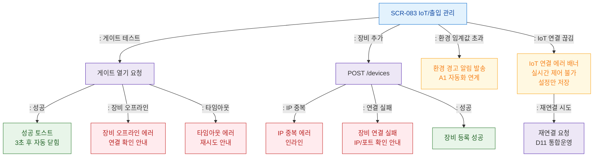

## 다이어그램

```mermaid
flowchart TD
    SCR083[SCR-083 IoT/출입 관리]

    SCR083 -->|": 게이트 테스트"|GateTest[게이트 열기 요청]
    GateTest -->|": 성공"|GateOK[성공 토스트\n3초 후 자동 닫힘]
    GateTest -->|": 장비 오프라인"|E_Offline[장비 오프라인 에러\n연결 확인 안내]
    GateTest -->|": 타임아웃"|E_Timeout[타임아웃 에러\n재시도 안내]

    SCR083 -->|": 장비 추가"|DeviceAdd[POST /devices]
    DeviceAdd -->|": IP 중복"|E_DupIP[IP 중복 에러\n인라인]
    DeviceAdd -->|": 연결 실패"|E_Connect[장비 연결 실패\n IP/포트 확인 안내]
    DeviceAdd -->|": 성공"|AddOK[장비 등록 성공]

    SCR083 -->|": 환경 임계값 초과"|EnvAlert[환경 경고 알림 발송\nA1 자동화 연계]

    SCR083 -->|": IoT 연결 끊김"|IoTErr[IoT 연결 에러 배너\n실시간 제어 불가\n설정만 저장]
    IoTErr -->|": 재연결 시도"|ReconnectIoT[재연결 요청\nD11 통합운영]

    classDef screen fill:#E3F2FD,stroke:#1976D2,color:#0D47A1
    classDef error fill:#FFEBEE,stroke:#C62828,color:#B71C1C
    classDef success fill:#E8F5E9,stroke:#2E7D32,color:#1B5E20
    classDef warning fill:#FFF8E1,stroke:#F9A825,color:#F57F17
    classDef system fill:#EDE7F6,stroke:#5E35B2
    class SCR083 screen
    class E_Offline,E_Timeout,E_DupIP,E_Connect error
    class GateOK,AddOK success
    class IoTErr,EnvAlert warning
    class GateTest,DeviceAdd,ReconnectIoT system
```

## TC 후보
- TC-083-007: 장비 오프라인 → 게이트 테스트 → 오프라인 에러
- TC-083-008: 환경 임계값 초과 → 경고 배너 + 알림 발송
