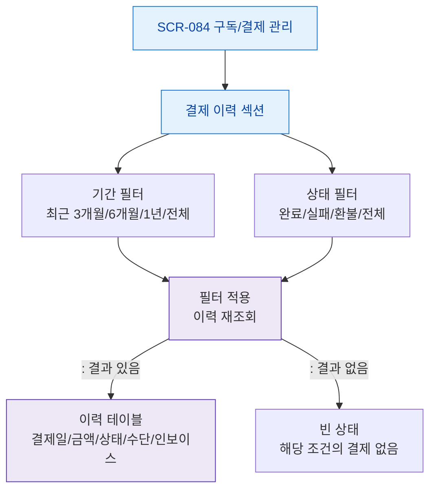

## 다이어그램

```mermaid
flowchart TD
    SCR084[SCR-084 구독/결제 관리]
    SCR084 --> HistorySection[결제 이력 섹션]

    HistorySection --> DateFilter[기간 필터\n최근 3개월/6개월/1년/전체]
    HistorySection --> StatusFilter[상태 필터\n완료/실패/환불/전체]

    DateFilter & StatusFilter --> FilterApply[필터 적용\n이력 재조회]
    FilterApply -->|": 결과 있음"|HistoryTable[이력 테이블\n결제일/금액/상태/수단/인보이스]
    FilterApply -->|": 결과 없음"|EmptyHistory[빈 상태\n해당 조건의 결제 없음]

    classDef screen fill:#E3F2FD,stroke:#1976D2,color:#0D47A1
    classDef system fill:#EDE7F6,stroke:#5E35B2
    class SCR084,HistorySection screen
    class FilterApply,HistoryTable system
```

## TC 후보
- TC-084-004: 결제 이력 테이블 표시
