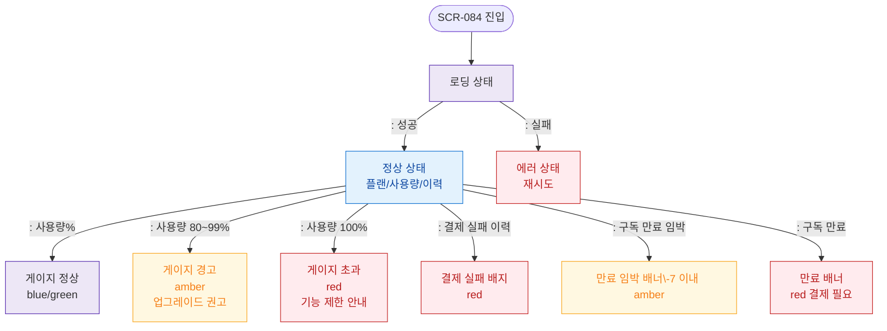

## 다이어그램

```mermaid
flowchart TD
    Entry([SCR-084 진입]) --> Loading[로딩 상태]
    Loading -->|": 성공"|Normal[정상 상태\n플랜/사용량/이력]
    Loading -->|": 실패"|ErrorState[에러 상태\n재시도]

    Normal -->|": 사용량%"|UsageNormal[게이지 정상\nblue/green]
    Normal -->|": 사용량 80~99%"|UsageWarn[게이지 경고\namber\n업그레이드 권고]
    Normal -->|": 사용량 100%"|UsageMax[게이지 초과\nred\n기능 제한 안내]

    Normal -->|": 결제 실패 이력"|PayFail[결제 실패 배지\nred]
    Normal -->|": 구독 만료 임박"|ExpireWarn[만료 임박 배너\-7 이내 amber]
    Normal -->|": 구독 만료"|ExpiredBanner[만료 배너\nred 결제 필요]

    classDef screen fill:#E3F2FD,stroke:#1976D2,color:#0D47A1
    classDef error fill:#FFEBEE,stroke:#C62828,color:#B71C1C
    classDef warning fill:#FFF8E1,stroke:#F9A825,color:#F57F17
    classDef system fill:#EDE7F6,stroke:#5E35B2
    class Normal screen
    class ErrorState,UsageMax,PayFail,ExpiredBanner error
    class UsageWarn,ExpireWarn warning
    class Loading,UsageNormal system
```

## TC 후보
- TC-084-002: 사용량 게이지 지점/직원/회원/용량 바 표시
