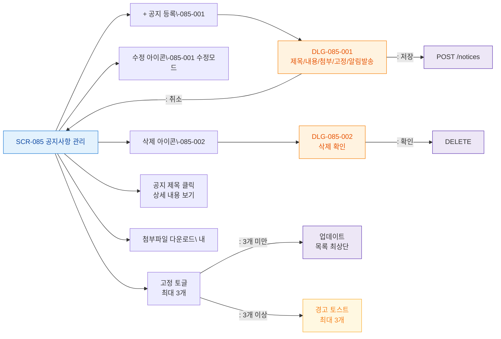

## 다이어그램

```mermaid
flowchart LR
    SCR085[SCR-085 공지사항 관리]

    SCR085 --> BTN_ADD[+ 공지 등록\-085-001]
    SCR085 --> BTN_EDIT[수정 아이콘\-085-001 수정모드]
    SCR085 --> BTN_DEL[삭제 아이콘\-085-002]
    SCR085 --> BTN_PIN[고정 토글\n최대 3개]
    SCR085 --> BTN_DETAIL[공지 제목 클릭\n상세 내용 보기]
    SCR085 --> BTN_ATTACH[첨부파일 다운로드\ 내]

    BTN_ADD --> DLG_001[DLG-085-001\n제목/내용/첨부/고정/알림발송]
    DLG_001 -->|": 저장"|ACT_POST[POST /notices]
    DLG_001 -->|": 취소"|SCR085

    BTN_DEL --> DLG_002[DLG-085-002\n삭제 확인]
    DLG_002 -->|": 확인"|ACT_DEL[DELETE]

    BTN_PIN -->|": 3개 미만"|ACT_PIN[업데이트\n목록 최상단]
    BTN_PIN -->|": 3개 이상"|ACT_PIN_ERR[경고 토스트\n최대 3개]

    classDef screen fill:#E3F2FD,stroke:#1976D2,color:#0D47A1
    classDef modal fill:#FFF3E0,stroke:#F57C00,color:#E65100
    classDef system fill:#EDE7F6,stroke:#5E35B2
    classDef warning fill:#FFF8E1,stroke:#F9A825,color:#F57F17
    class SCR085 screen
    class DLG_001,DLG_002 modal
    class ACT_POST,ACT_DEL,ACT_PIN system
    class ACT_PIN_ERR warning
```

## TC 후보
- TC-085-001: + 공지 등록 → 저장 → 목록 추가
- TC-085-002: 고정 토글 → 최상단 표시
- TC-085-003: 삭제 → 확인 → 제거
