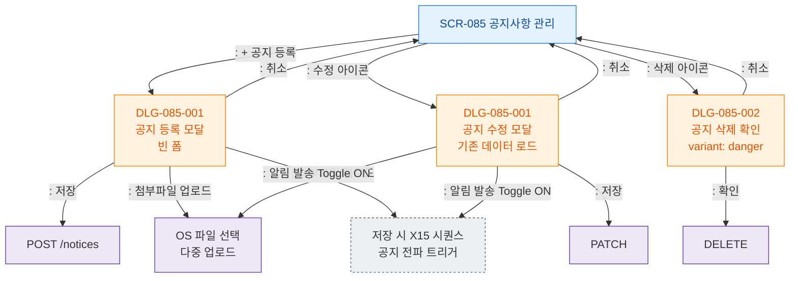

## 다이어그램

```mermaid
flowchart TD
    SCR085[SCR-085 공지사항 관리]

    SCR085 -->|": + 공지 등록"|DLG_001_New[DLG-085-001\n공지 등록 모달\n빈 폼]
    DLG_001_New -->|": 저장"|ACT_POST[POST /notices]
    DLG_001_New -->|": 취소"|SCR085

    SCR085 -->|": 수정 아이콘"|DLG_001_Edit[DLG-085-001\n공지 수정 모달\n기존 데이터 로드]
    DLG_001_Edit -->|": 저장"|ACT_PATCH[PATCH]
    DLG_001_Edit -->|": 취소"|SCR085

    DLG_001_New & DLG_001_Edit -->|": 첨부파일 업로드"|FileUpload[OS 파일 선택\n다중 업로드]
    DLG_001_New & DLG_001_Edit -->|": 알림 발송 Toggle ON"|X15_Trigger[저장 시 X15 시퀀스\n공지 전파 트리거]

    SCR085 -->|": 삭제 아이콘"|DLG_002[DLG-085-002\n공지 삭제 확인\nvariant: danger]
    DLG_002 -->|": 확인"|ACT_DEL[DELETE]
    DLG_002 -->|": 취소"|SCR085

    classDef screen fill:#E3F2FD,stroke:#1976D2,color:#0D47A1
    classDef modal fill:#FFF3E0,stroke:#F57C00,color:#E65100
    classDef system fill:#EDE7F6,stroke:#5E35B2
    classDef external fill:#ECEFF1,stroke:#455A64,stroke-dasharray:3 3
    class SCR085 screen
    class DLG_001_New,DLG_001_Edit,DLG_002 modal
    class ACT_POST,ACT_PATCH,ACT_DEL,FileUpload system
    class X15_Trigger external
```

## TC 후보
- TC-085-001: + 공지 등록 → DLG-085-001 → 저장
- TC-085-003: 삭제 → DLG-085-002 → 확인 → 삭제
