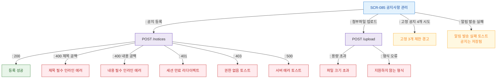

## 다이어그램

```mermaid
flowchart TD
    SCR085[SCR-085 공지사항 관리]

    SCR085 -->|": 공지 등록"|PostReq[POST /notices]
    PostReq -->|": 200"|PostOK[등록 성공]
    PostReq -->|": 400 제목 공백"|E_Title[제목 필수 인라인 에러]
    PostReq -->|": 400 내용 공백"|E_Content[내용 필수 인라인 에러]
    PostReq -->|": 401"|E_Auth[세션 만료 리다이렉트]
    PostReq -->|": 403"|E_Perm[권한 없음 토스트]
    PostReq -->|": 500"|E_Server[서버 에러 토스트]

    SCR085 -->|": 첨부파일 업로드"|UploadReq[POST /upload]
    UploadReq -->|": 용량 초과"|E_FileSize[파일 크기 초과]
    UploadReq -->|": 형식 오류"|E_FileType[지원하지 않는 형식]

    SCR085 -->|": 고정 공지 4개 시도"|E_PinMax[고정 3개 제한 경고]

    SCR085 -->|": 알림 발송 실패"|E_Notify[알림 발송 실패 토스트\n공지는 저장됨]

    classDef screen fill:#E3F2FD,stroke:#1976D2,color:#0D47A1
    classDef error fill:#FFEBEE,stroke:#C62828,color:#B71C1C
    classDef success fill:#E8F5E9,stroke:#2E7D32,color:#1B5E20
    classDef warning fill:#FFF8E1,stroke:#F9A825,color:#F57F17
    classDef system fill:#EDE7F6,stroke:#5E35B2
    class SCR085 screen
    class E_Title,E_Content,E_Auth,E_Perm,E_Server,E_FileSize,E_FileType error
    class PostOK success
    class E_PinMax,E_Notify warning
    class PostReq,UploadReq system
```

## TC 후보
- TC-085-NEG-002: 제목 공백 → 저장 시 인라인 에러
- TC-085-NEG-003: 고정 공지 4개 시도 → 경고 토스트
