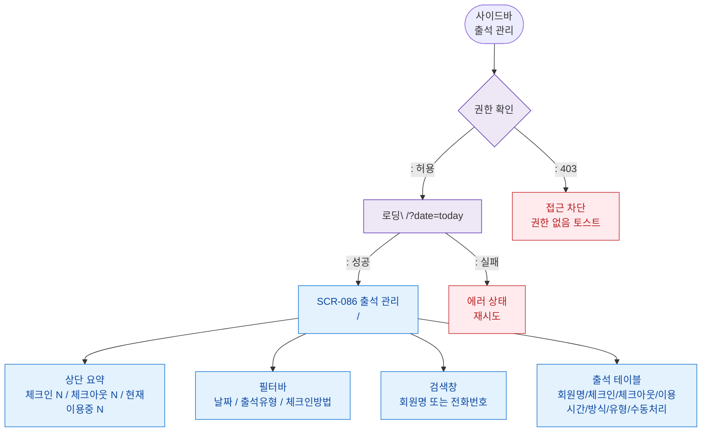

## 다이어그램

```mermaid
flowchart TD
    Sidebar([사이드바\n출석 관리]) --> Auth{권한 확인}
    Auth -->|": 허용"|Loading[로딩\ /?date=today]
    Auth -->|": 403"|Blocked[접근 차단\n권한 없음 토스트]

    Loading -->|": 성공"|SCR086[SCR-086 출석 관리\n/]
    Loading -->|": 실패"|ErrorState[에러 상태\n재시도]

    SCR086 --> Summary[상단 요약\n체크인 N / 체크아웃 N / 현재이용중 N]
    SCR086 --> FilterBar[필터바\n날짜 / 출석유형 / 체크인방법]
    SCR086 --> SearchBar[검색창\n회원명 또는 전화번호]
    SCR086 --> AttendanceTable[출석 테이블\n회원명/체크인/체크아웃/이용시간/방식/유형/수동처리]

    classDef screen fill:#E3F2FD,stroke:#1976D2,color:#0D47A1
    classDef error fill:#FFEBEE,stroke:#C62828,color:#B71C1C
    classDef system fill:#EDE7F6,stroke:#5E35B2
    classDef rbacBlocked fill:#F5F5F5,stroke:#9E9E9E,color:#616161
    class SCR086,Summary,FilterBar,SearchBar,AttendanceTable screen
    class ErrorState,Blocked error
    class Loading,Auth system
```

## TC 후보
- TC-086-001: 사이드바 > 출석 관리 진입 → 오늘 날짜 출석 목록 표시
