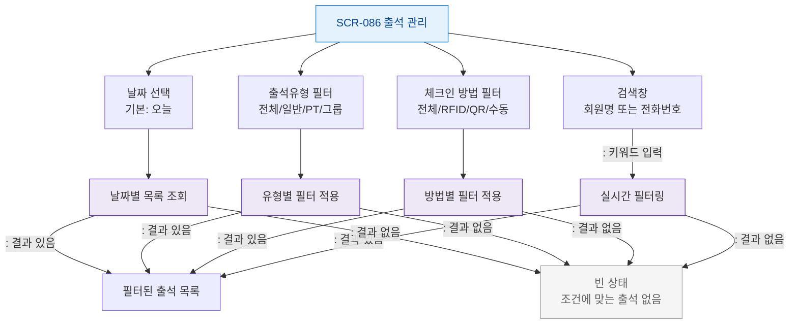

## 다이어그램

```mermaid
flowchart TD
    SCR086[SCR-086 출석 관리]

    SCR086 --> DatePicker[날짜 선택\n기본: 오늘]
    SCR086 --> TypeFilter[출석유형 필터\n전체/일반/PT/그룹]
    SCR086 --> MethodFilter[체크인 방법 필터\n전체/RFID/QR/수동]
    SCR086 --> SearchBar[검색창\n회원명 또는 전화번호]

    DatePicker --> Apply1[날짜별 목록 조회]
    TypeFilter --> Apply2[유형별 필터 적용]
    MethodFilter --> Apply3[방법별 필터 적용]
    SearchBar -->|": 키워드 입력"|Apply4[실시간 필터링]

    Apply1 & Apply2 & Apply3 & Apply4 -->|": 결과 있음"|ResultList[필터된 출석 목록]
    Apply1 & Apply2 & Apply3 & Apply4 -->|": 결과 없음"|EmptyState[빈 상태\n조건에 맞는 출석 없음]

    classDef screen fill:#E3F2FD,stroke:#1976D2,color:#0D47A1
    classDef system fill:#EDE7F6,stroke:#5E35B2
    classDef rbacBlocked fill:#F5F5F5,stroke:#9E9E9E,color:#616161
    class SCR086 screen
    class Apply1,Apply2,Apply3,Apply4 system
    class EmptyState rbacBlocked
```

## TC 후보
- TC-086-005: 날짜 변경 → 해당 날짜 출석 목록
- TC-086-006: 회원명 검색 → 매칭 회원만 표시
