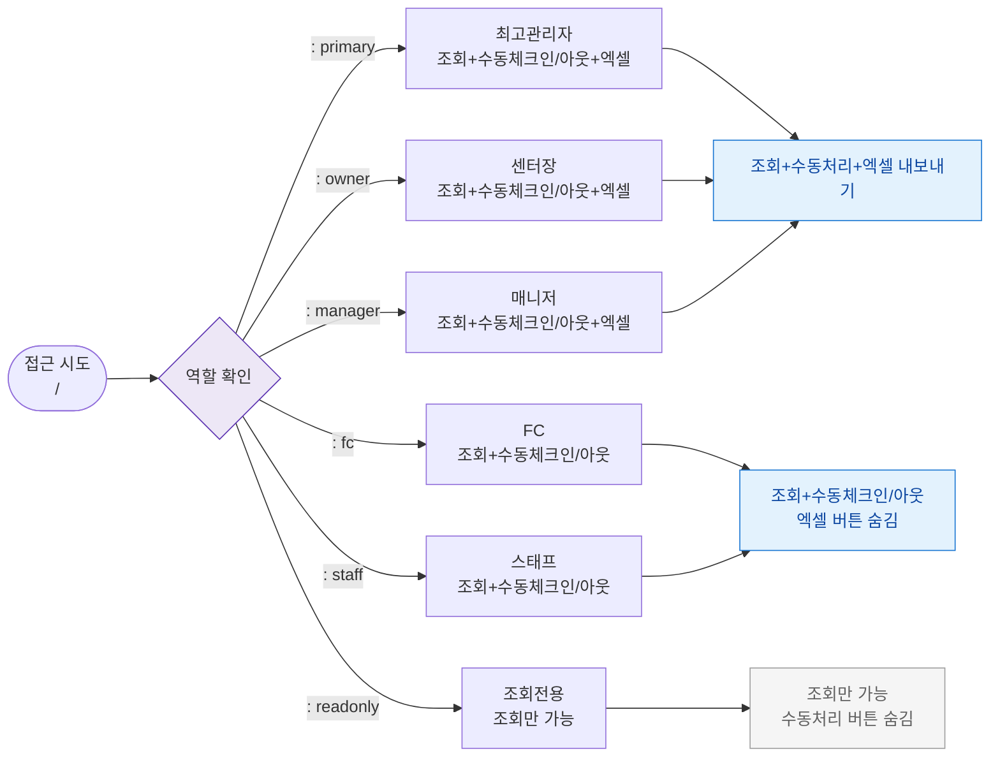

## 다이어그램

## 역할별 접근 매트릭스
| 역할 | 접근 | 조회 | 수동체크인 | 수동체크아웃 | 엑셀내보내기 |
|------|:---:|:---:|:--------:|:-----------:|:-----------:|
| primary | ✅ | ✅ | ✅ | ✅ | ✅ |
| owner | ✅ | ✅ | ✅ | ✅ | ✅ |
| manager | ✅ | ✅ | ✅ | ✅ | ✅ |
| fc | ✅ | ✅ | ✅ | ✅ | ❌ |
| staff | ✅ | ✅ | ✅ | ✅ | ❌ |
| readonly | ✅ | ✅ | ❌ | ❌ | ❌ |

## TC 후보
- TC-086-NEG-001: readonly → / → 수동처리 버튼 미표시
