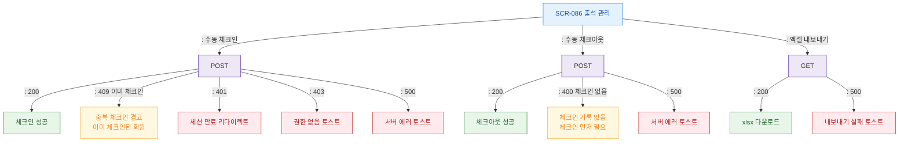

## 다이어그램

```mermaid
flowchart TD
    SCR086[SCR-086 출석 관리]

    SCR086 -->|": 수동 체크인"|CheckinReq[POST]
    CheckinReq -->|": 200"|CheckinOK[체크인 성공]
    CheckinReq -->|": 409 이미 체크인"|E_Dup[중복 체크인 경고\n이미 체크인된 회원]
    CheckinReq -->|": 401"|E_Auth[세션 만료 리다이렉트]
    CheckinReq -->|": 403"|E_Perm[권한 없음 토스트]
    CheckinReq -->|": 500"|E_Server[서버 에러 토스트]

    SCR086 -->|": 수동 체크아웃"|CheckoutReq[POST]
    CheckoutReq -->|": 200"|CheckoutOK[체크아웃 성공]
    CheckoutReq -->|": 400 체크인 없음"|E_NoCheckin[체크인 기록 없음\n체크인 먼저 필요]
    CheckoutReq -->|": 500"|E_Server2[서버 에러 토스트]

    SCR086 -->|": 엑셀 내보내기"|ExportReq[GET]
    ExportReq -->|": 200"|ExportOK[xlsx 다운로드]
    ExportReq -->|": 500"|E_Export[내보내기 실패 토스트]

    classDef screen fill:#E3F2FD,stroke:#1976D2,color:#0D47A1
    classDef error fill:#FFEBEE,stroke:#C62828,color:#B71C1C
    classDef success fill:#E8F5E9,stroke:#2E7D32,color:#1B5E20
    classDef warning fill:#FFF8E1,stroke:#F9A825,color:#F57F17
    classDef system fill:#EDE7F6,stroke:#5E35B2
    class SCR086 screen
    class CheckinOK,CheckoutOK,ExportOK success
    class E_Dup,E_NoCheckin warning
    class E_Auth,E_Perm,E_Server,E_Server2,E_Export error
    class CheckinReq,CheckoutReq,ExportReq system
```

## TC 후보
- TC-086-NEG-002: 이미 체크인된 회원 체크인 시도 → 409 중복 경고
