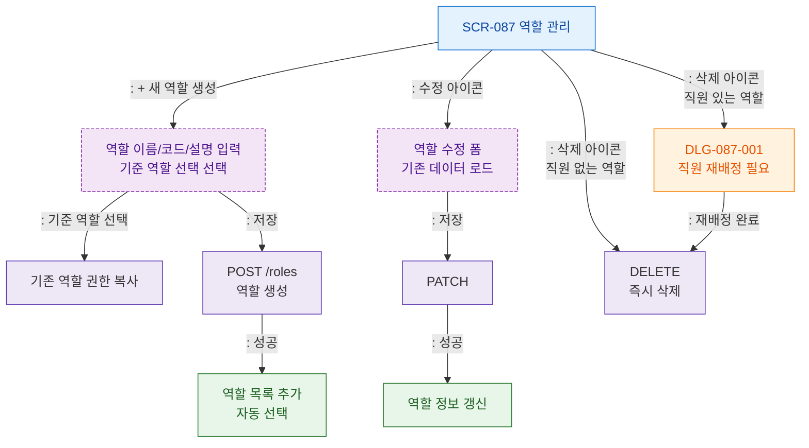

## 다이어그램

```mermaid
flowchart TD
    SCR087[SCR-087 역할 관리]

    SCR087 -->|": + 새 역할 생성"|NewRoleForm[역할 이름/코드/설명 입력\n기준 역할 선택 선택]
    NewRoleForm -->|": 기준 역할 선택"|CopyPerms[기존 역할 권한 복사]
    NewRoleForm -->|": 저장"|ACT_Create[POST /roles\n역할 생성]
    ACT_Create -->|": 성공"|RoleAdded[역할 목록 추가\n자동 선택]

    SCR087 -->|": 수정 아이콘"|EditForm[역할 수정 폼\n기존 데이터 로드]
    EditForm -->|": 저장"|ACT_Update[PATCH]
    ACT_Update -->|": 성공"|RoleUpdated[역할 정보 갱신]

    SCR087 -->|": 삭제 아이콘\n직원 없는 역할"|ACT_Delete[DELETE \n즉시 삭제]
    SCR087 -->|": 삭제 아이콘\n직원 있는 역할"|DLG001[DLG-087-001\n직원 재배정 필요]
    DLG001 -->|": 재배정 완료"|ACT_Delete

    classDef screen fill:#E3F2FD,stroke:#1976D2,color:#0D47A1
    classDef newFeature fill:#F3E5F5,stroke:#7B1FA2,color:#4A148C,stroke-dasharray:4 2
    classDef success fill:#E8F5E9,stroke:#2E7D32,color:#1B5E20
    classDef modal fill:#FFF3E0,stroke:#F57C00,color:#E65100
    classDef system fill:#EDE7F6,stroke:#5E35B2
    class SCR087 screen
    class NewRoleForm,EditForm newFeature
    class RoleAdded,RoleUpdated success
    class DLG001 modal
    class ACT_Create,ACT_Update,ACT_Delete,CopyPerms system
```

## TC 후보
- TC-087-002: + 새 역할 생성 → 저장 → 목록 추가
- TC-087-003: 기준 역할 선택 → 권한 복사 적용
