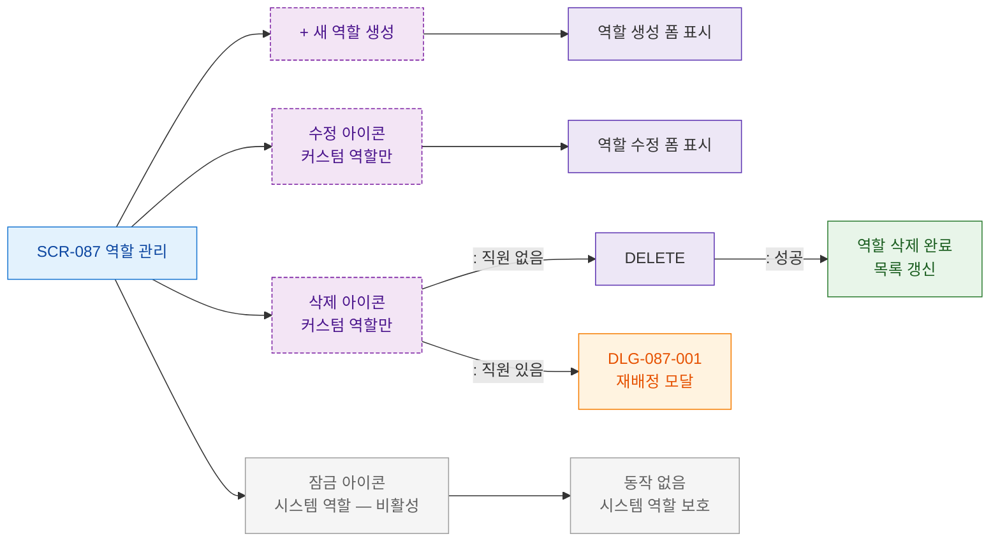

## 다이어그램

```mermaid
flowchart LR
    SCR087[SCR-087 역할 관리]

    SCR087 --> BtnNew[+ 새 역할 생성]
    SCR087 --> BtnEdit[수정 아이콘\n커스텀 역할만]
    SCR087 --> BtnDelete[삭제 아이콘\n커스텀 역할만]
    SCR087 --> BtnLock[잠금 아이콘\n시스템 역할 — 비활성]

    BtnNew --> ACT_New[역할 생성 폼 표시]
    BtnEdit --> ACT_Edit[역할 수정 폼 표시]
    BtnDelete -->|": 직원 없음"|ACT_DirectDelete[DELETE]
    BtnDelete -->|": 직원 있음"|ACT_DlgDelete[DLG-087-001\n재배정 모달]
    BtnLock --> NoAction[동작 없음\n시스템 역할 보호]

    ACT_DirectDelete -->|": 성공"|OK_Delete[역할 삭제 완료\n목록 갱신]

    classDef screen fill:#E3F2FD,stroke:#1976D2,color:#0D47A1
    classDef newFeature fill:#F3E5F5,stroke:#7B1FA2,color:#4A148C,stroke-dasharray:4 2
    classDef success fill:#E8F5E9,stroke:#2E7D32,color:#1B5E20
    classDef modal fill:#FFF3E0,stroke:#F57C00,color:#E65100
    classDef system fill:#EDE7F6,stroke:#5E35B2
    classDef rbacBlocked fill:#F5F5F5,stroke:#9E9E9E,color:#616161
    class SCR087 screen
    class BtnNew,BtnEdit,BtnDelete newFeature
    class OK_Delete success
    class ACT_DlgDelete modal
    class ACT_New,ACT_Edit,ACT_DirectDelete system
    class BtnLock,NoAction rbacBlocked
```

## TC 후보
- TC-087-002: + 새 역할 생성 → 폼 표시 → 저장
- TC-087-004: 시스템 역할 → 잠금 아이콘 → 수정/삭제 불가
