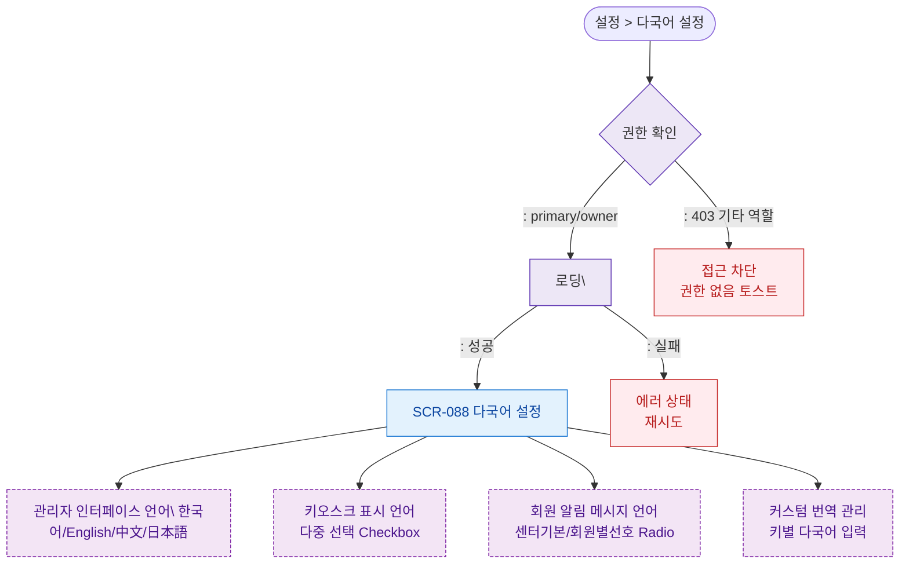

## 다이어그램

```mermaid
flowchart TD
    Sidebar([설정 > 다국어 설정]) --> Auth{권한 확인}
    Auth -->|": primary/owner"|Loading[로딩\]
    Auth -->|": 403 기타 역할"|Blocked[접근 차단\n권한 없음 토스트]

    Loading -->|": 성공"|SCR088[SCR-088 다국어 설정\n]
    Loading -->|": 실패"|ErrorState[에러 상태\n재시도]

    SCR088 --> AdminLang[관리자 인터페이스 언어\ 한국어/English/中文/日本語]
    SCR088 --> KioskLang[키오스크 표시 언어\n다중 선택 Checkbox]
    SCR088 --> NotifyLang[회원 알림 메시지 언어\n센터기본/회원별선호 Radio]
    SCR088 --> TranslationTable[커스텀 번역 관리\n키별 다국어 입력]

    classDef screen fill:#E3F2FD,stroke:#1976D2,color:#0D47A1
    classDef newFeature fill:#F3E5F5,stroke:#7B1FA2,color:#4A148C,stroke-dasharray:4 2
    classDef error fill:#FFEBEE,stroke:#C62828,color:#B71C1C
    classDef system fill:#EDE7F6,stroke:#5E35B2
    class SCR088 screen
    class AdminLang,KioskLang,NotifyLang,TranslationTable newFeature
    class ErrorState,Blocked error
    class Loading,Auth system
```

## TC 후보
- TC-088-001: 설정 > 다국어 설정 진입 → 현재 언어 설정 표시
