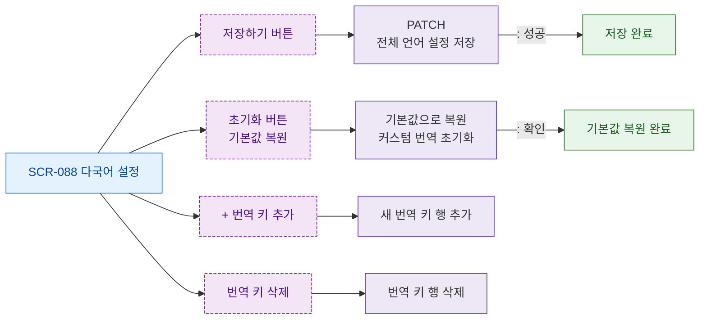

## 다이어그램

```mermaid
flowchart LR
    SCR088[SCR-088 다국어 설정]

    SCR088 --> BtnSave[저장하기 버튼]
    SCR088 --> BtnReset[초기화 버튼\n기본값 복원]
    SCR088 --> BtnAddKey[+ 번역 키 추가]
    SCR088 --> BtnDeleteKey[번역 키 삭제]

    BtnSave --> ACT_Save[PATCH \n전체 언어 설정 저장]
    BtnReset --> ACT_Reset[기본값으로 복원\n커스텀 번역 초기화]
    BtnAddKey --> ACT_AddKey[새 번역 키 행 추가]
    BtnDeleteKey --> ACT_DelKey[번역 키 행 삭제]

    ACT_Save -->|": 성공"|OK_Save[저장 완료]
    ACT_Reset -->|": 확인"|OK_Reset[기본값 복원 완료]

    classDef screen fill:#E3F2FD,stroke:#1976D2,color:#0D47A1
    classDef newFeature fill:#F3E5F5,stroke:#7B1FA2,color:#4A148C,stroke-dasharray:4 2
    classDef success fill:#E8F5E9,stroke:#2E7D32,color:#1B5E20
    classDef system fill:#EDE7F6,stroke:#5E35B2
    class SCR088 screen
    class BtnSave,BtnReset,BtnAddKey,BtnDeleteKey newFeature
    class OK_Save,OK_Reset success
    class ACT_Save,ACT_Reset,ACT_AddKey,ACT_DelKey system
```

## TC 후보
- TC-088-002: 저장하기 → PATCH 성공 → 저장 완료
