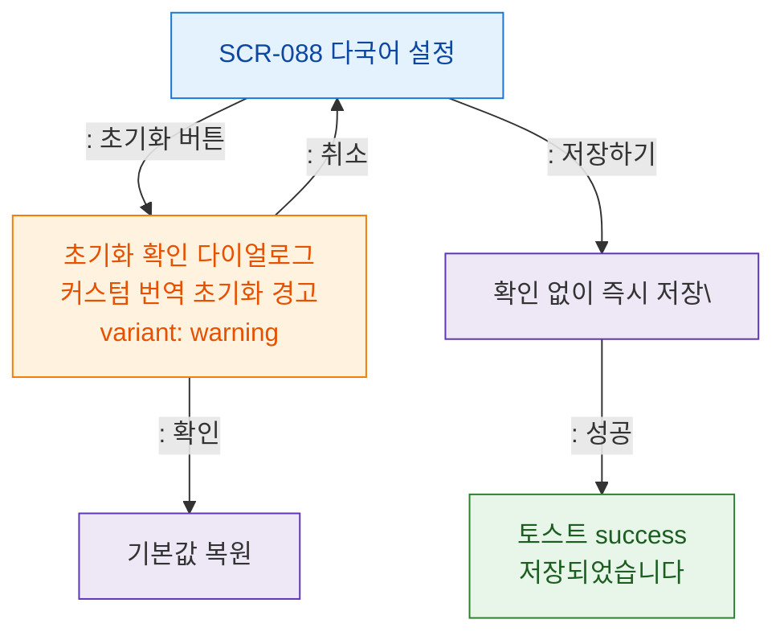

## 다이어그램

```mermaid
flowchart TD
    SCR088[SCR-088 다국어 설정]

    SCR088 -->|": 초기화 버튼"|DLG_Reset[초기화 확인 다이얼로그\n커스텀 번역 초기화 경고\nvariant: warning]
    DLG_Reset -->|": 확인"|ACT_Reset[기본값 복원]
    DLG_Reset -->|": 취소"|SCR088

    SCR088 -->|": 저장하기"|DirectSave[확인 없이 즉시 저장\]
    DirectSave -->|": 성공"|T_SaveOK[토스트 success\n저장되었습니다]

    classDef screen fill:#E3F2FD,stroke:#1976D2,color:#0D47A1
    classDef newFeature fill:#F3E5F5,stroke:#7B1FA2,color:#4A148C,stroke-dasharray:4 2
    classDef modal fill:#FFF3E0,stroke:#F57C00,color:#E65100
    classDef success fill:#E8F5E9,stroke:#2E7D32,color:#1B5E20
    classDef system fill:#EDE7F6,stroke:#5E35B2
    class SCR088 screen
    class DLG_Reset modal
    class T_SaveOK success
    class DirectSave,ACT_Reset system
```

## TC 후보
- TC-088-002: 저장 → 즉시 PATCH → 성공 토스트
