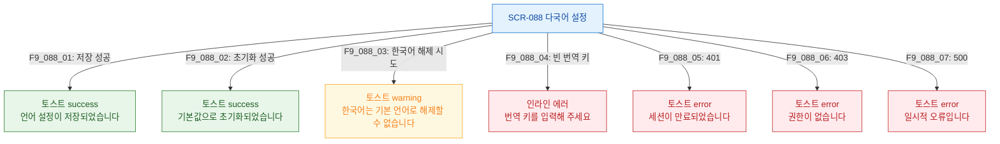

## 다이어그램

## 토스트 메시지 목록
| ID | 트리거 | 타입 | 메시지 |
|----|--------|------|--------|
| F9_088_01 | 저장 성공 | success | 언어 설정이 저장되었습니다 |
| F9_088_02 | 초기화 성공 | success | 기본값으로 초기화되었습니다 |
| F9_088_03 | 한국어 해제 시도 | warning | 한국어는 기본 언어로 해제할 수 없습니다 |
| F9_088_04 | 빈 번역 키 | error(inline) | 번역 키를 입력해 주세요 |
| F9_088_05 | 401 | error | 세션이 만료되었습니다 |
| F9_088_06 | 403 | error | 권한이 없습니다 |
| F9_088_07 | 500 | error | 일시적 오류입니다 |
