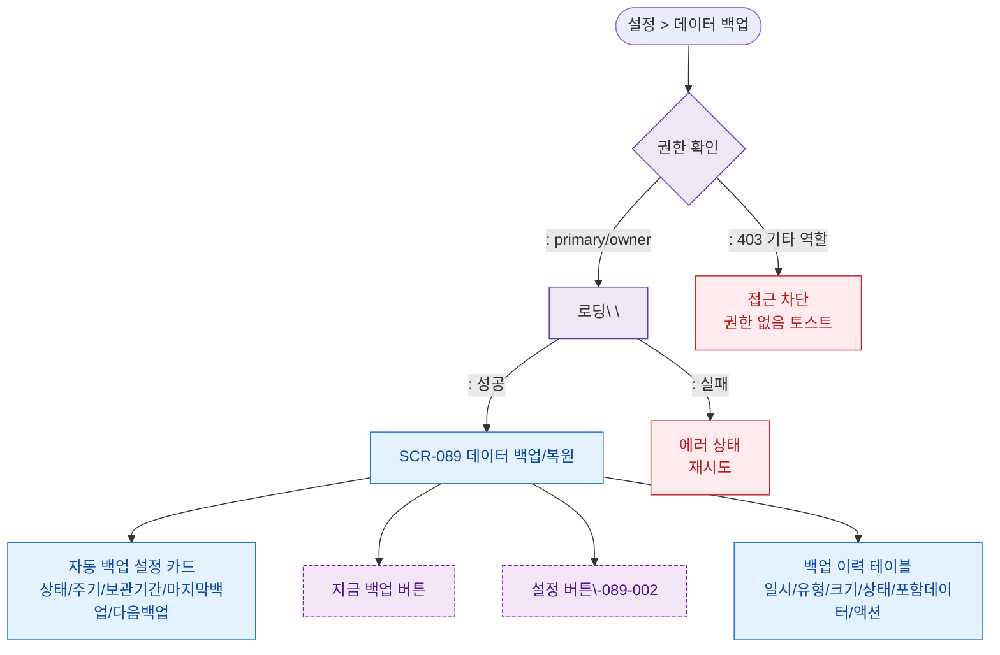

## 다이어그램

```mermaid
flowchart TD
    Sidebar([설정 > 데이터 백업]) --> Auth{권한 확인}
    Auth -->|": primary/owner"|Loading[로딩\ \]
    Auth -->|": 403 기타 역할"|Blocked[접근 차단\n권한 없음 토스트]

    Loading -->|": 성공"|SCR089[SCR-089 데이터 백업/복원\n]
    Loading -->|": 실패"|ErrorState[에러 상태\n재시도]

    SCR089 --> AutoBackupCard[자동 백업 설정 카드\n상태/주기/보관기간/마지막백업/다음백업]
    SCR089 --> BtnNowBackup[지금 백업 버튼]
    SCR089 --> BtnSettings[설정 버튼\-089-002]
    SCR089 --> BackupHistory[백업 이력 테이블\n일시/유형/크기/상태/포함데이터/액션]

    classDef screen fill:#E3F2FD,stroke:#1976D2,color:#0D47A1
    classDef newFeature fill:#F3E5F5,stroke:#7B1FA2,color:#4A148C,stroke-dasharray:4 2
    classDef error fill:#FFEBEE,stroke:#C62828,color:#B71C1C
    classDef system fill:#EDE7F6,stroke:#5E35B2
    class SCR089,AutoBackupCard,BackupHistory screen
    class BtnNowBackup,BtnSettings newFeature
    class ErrorState,Blocked error
    class Loading,Auth system
```

## TC 후보
- TC-089-001: 설정 > 데이터 백업 진입 → 자동 백업 상태 + 이력 표시
