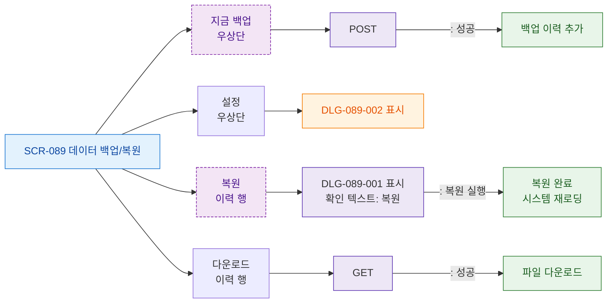

## 다이어그램

```mermaid
flowchart LR
    SCR089[SCR-089 데이터 백업/복원]

    SCR089 --> BtnNowBackup[지금 백업\n우상단]
    SCR089 --> BtnSettings[설정\n우상단]
    SCR089 --> BtnRestore[복원\n이력 행]
    SCR089 --> BtnDownload[다운로드\n이력 행]

    BtnNowBackup --> ACT_Manual[POST]
    BtnSettings --> ACT_Settings[DLG-089-002 표시]
    BtnRestore --> ACT_RestoreDlg[DLG-089-001 표시\n확인 텍스트: 복원]
    BtnDownload --> ACT_Download[GET]

    ACT_Manual -->|": 성공"|OK_Backup[백업 이력 추가]
    ACT_RestoreDlg -->|": 복원 실행"|OK_Restore[복원 완료\n시스템 재로딩]
    ACT_Download -->|": 성공"|OK_Download[파일 다운로드]

    classDef screen fill:#E3F2FD,stroke:#1976D2,color:#0D47A1
    classDef newFeature fill:#F3E5F5,stroke:#7B1FA2,color:#4A148C,stroke-dasharray:4 2
    classDef success fill:#E8F5E9,stroke:#2E7D32,color:#1B5E20
    classDef modal fill:#FFF3E0,stroke:#F57C00,color:#E65100
    classDef system fill:#EDE7F6,stroke:#5E35B2
    class SCR089 screen
    class BtnNowBackup,BtnRestore newFeature
    class OK_Backup,OK_Restore,OK_Download success
    class ACT_Settings modal
    class ACT_Manual,ACT_RestoreDlg,ACT_Download system
```

## TC 후보
- TC-089-002: 지금 백업 → 성공 → 이력 추가
- TC-089-003: 복원 버튼 → DLG-089-001 → 복원 실행
