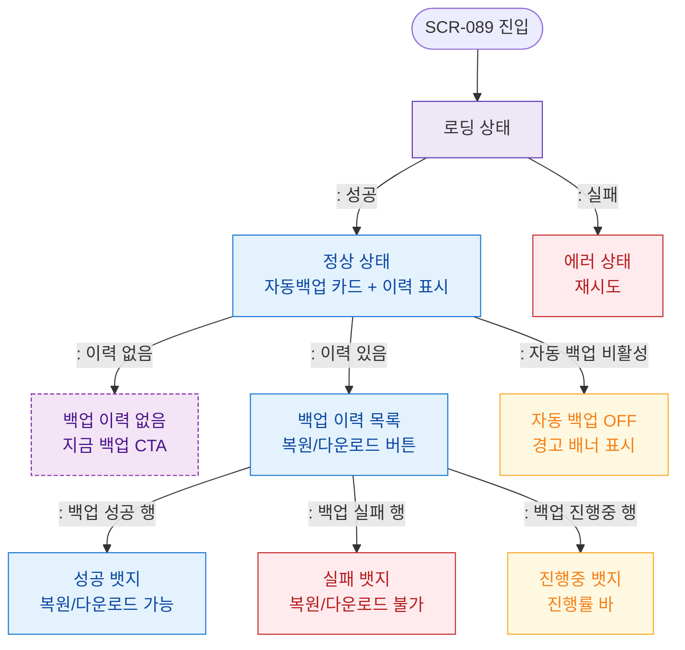

## 다이어그램

```mermaid
flowchart TD
    Entry([SCR-089 진입]) --> Loading[로딩 상태]
    Loading -->|": 성공"|Normal[정상 상태\n자동백업 카드 + 이력 표시]
    Loading -->|": 실패"|ErrorState[에러 상태\n재시도]

    Normal -->|": 이력 없음"|NoHistory[백업 이력 없음\n지금 백업 CTA]
    Normal -->|": 이력 있음"|HasHistory[백업 이력 목록\n복원/다운로드 버튼]

    HasHistory -->|": 백업 성공 행"|SuccessRow[성공 뱃지\n복원/다운로드 가능]
    HasHistory -->|": 백업 실패 행"|FailRow[실패 뱃지\n복원/다운로드 불가]
    HasHistory -->|": 백업 진행중 행"|InProgressRow[진행중 뱃지\n진행률 바]

    Normal -->|": 자동 백업 비활성"|AutoOff[자동 백업 OFF\n경고 배너 표시]

    classDef screen fill:#E3F2FD,stroke:#1976D2,color:#0D47A1
    classDef newFeature fill:#F3E5F5,stroke:#7B1FA2,color:#4A148C,stroke-dasharray:4 2
    classDef error fill:#FFEBEE,stroke:#C62828,color:#B71C1C
    classDef success fill:#E8F5E9,stroke:#2E7D32,color:#1B5E20
    classDef warning fill:#FFF8E1,stroke:#F9A825,color:#F57F17
    classDef system fill:#EDE7F6,stroke:#5E35B2
    class Normal,HasHistory,SuccessRow screen
    class NoHistory newFeature
    class ErrorState,FailRow error
    class Loading system
    class InProgressRow,AutoOff warning
```

## TC 후보
- TC-089-006: 백업 이력 없음 → 빈 상태 + 지금 백업 CTA
