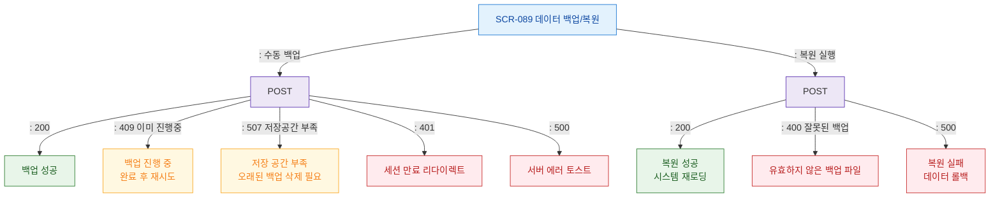

## 다이어그램

```mermaid
flowchart TD
    SCR089[SCR-089 데이터 백업/복원]

    SCR089 -->|": 수동 백업"|BackupReq[POST]
    BackupReq -->|": 200"|BackupOK[백업 성공]
    BackupReq -->|": 409 이미 진행중"|E_InProgress[백업 진행 중\n완료 후 재시도]
    BackupReq -->|": 507 저장공간 부족"|E_Storage[저장 공간 부족\n오래된 백업 삭제 필요]
    BackupReq -->|": 401"|E_Auth[세션 만료 리다이렉트]
    BackupReq -->|": 500"|E_Server[서버 에러 토스트]

    SCR089 -->|": 복원 실행"|RestoreReq[POST]
    RestoreReq -->|": 200"|RestoreOK[복원 성공\n시스템 재로딩]
    RestoreReq -->|": 400 잘못된 백업"|E_InvalidBackup[유효하지 않은 백업 파일]
    RestoreReq -->|": 500"|E_RestoreFail[복원 실패\n데이터 롤백]

    classDef screen fill:#E3F2FD,stroke:#1976D2,color:#0D47A1
    classDef error fill:#FFEBEE,stroke:#C62828,color:#B71C1C
    classDef success fill:#E8F5E9,stroke:#2E7D32,color:#1B5E20
    classDef warning fill:#FFF8E1,stroke:#F9A825,color:#F57F17
    classDef system fill:#EDE7F6,stroke:#5E35B2
    class SCR089 screen
    class BackupOK,RestoreOK success
    class E_InProgress,E_Storage warning
    class E_Auth,E_Server,E_InvalidBackup,E_RestoreFail error
    class BackupReq,RestoreReq system
```

## TC 후보
- TC-089-NEG-002: 백업 진행 중 재시도 → 409 경고
