## 다이어그램

```mermaid
flowchart TD
    SCR089[SCR-089 데이터 백업/복원]

    SCR089 -->|"F9_089_01: 수동 백업 성공"|T_BackupOK[토스트 success\n백업이 완료되었습니다]
    SCR089 -->|"F9_089_02: 복원 완료"|T_RestoreOK[토스트 success\n복원이 완료되었습니다\n시스템을 재시작합니다]
    SCR089 -->|"F9_089_03: 백업 설정 저장 성공"|T_SettingsOK[토스트 success\n백업 설정이 저장되었습니다]

    SCR089 -->|"F9_089_04: 백업 진행 중 재시도"|T_InProgress[토스트 warning\n백업이 진행 중입니다\n완료 후 다시 시도해 주세요]
    SCR089 -->|"F9_089_05: 저장 공간 부족"|T_Storage[토스트 warning\n저장 공간이 부족합니다\n오래된 백업을 삭제해 주세요]

    SCR089 -->|"F9_089_06: 백업 실패"|T_BackupFail[토스트 error\n백업에 실패했습니다]
    SCR089 -->|"F9_089_07: 복원 실패"|T_RestoreFail[토스트 error\n복원에 실패했습니다\n데이터가 롤백되었습니다]
    SCR089 -->|"F9_089_08: 401"|T_Auth[토스트 error\n세션이 만료되었습니다]
    SCR089 -->|"F9_089_09: 403"|T_Perm[토스트 error\n권한이 없습니다]
    SCR089 -->|"F9_089_10: 500"|T_Server[토스트 error\n일시적 오류입니다]

    classDef screen fill:#E3F2FD,stroke:#1976D2,color:#0D47A1
    classDef success fill:#E8F5E9,stroke:#2E7D32,color:#1B5E20
    classDef warning fill:#FFF8E1,stroke:#F9A825,color:#F57F17
    classDef error fill:#FFEBEE,stroke:#C62828,color:#B71C1C
    class SCR089 screen
    class T_BackupOK,T_RestoreOK,T_SettingsOK success
    class T_InProgress,T_Storage warning
    class T_BackupFail,T_RestoreFail,T_Auth,T_Perm,T_Server error
```

## 토스트 메시지 목록
| ID | 트리거 | 타입 | 메시지 |
|----|--------|------|--------|
| F9_089_01 | 수동 백업 성공 | success | 백업이 완료되었습니다 |
| F9_089_02 | 복원 완료 | success | 복원이 완료되었습니다 |
| F9_089_03 | 백업 설정 저장 | success | 백업 설정이 저장되었습니다 |
| F9_089_04 | 백업 진행 중 재시도 | warning | 백업이 진행 중입니다 |
| F9_089_05 | 저장 공간 부족 | warning | 저장 공간이 부족합니다 |
| F9_089_06 | 백업 실패 | error | 백업에 실패했습니다 |
| F9_089_07 | 복원 실패 | error | 복원에 실패했습니다 |
| F9_089_08 | 401 | error | 세션이 만료되었습니다 |
| F9_089_09 | 403 | error | 권한이 없습니다 |
| F9_089_10 | 500 | error | 일시적 오류입니다 |
