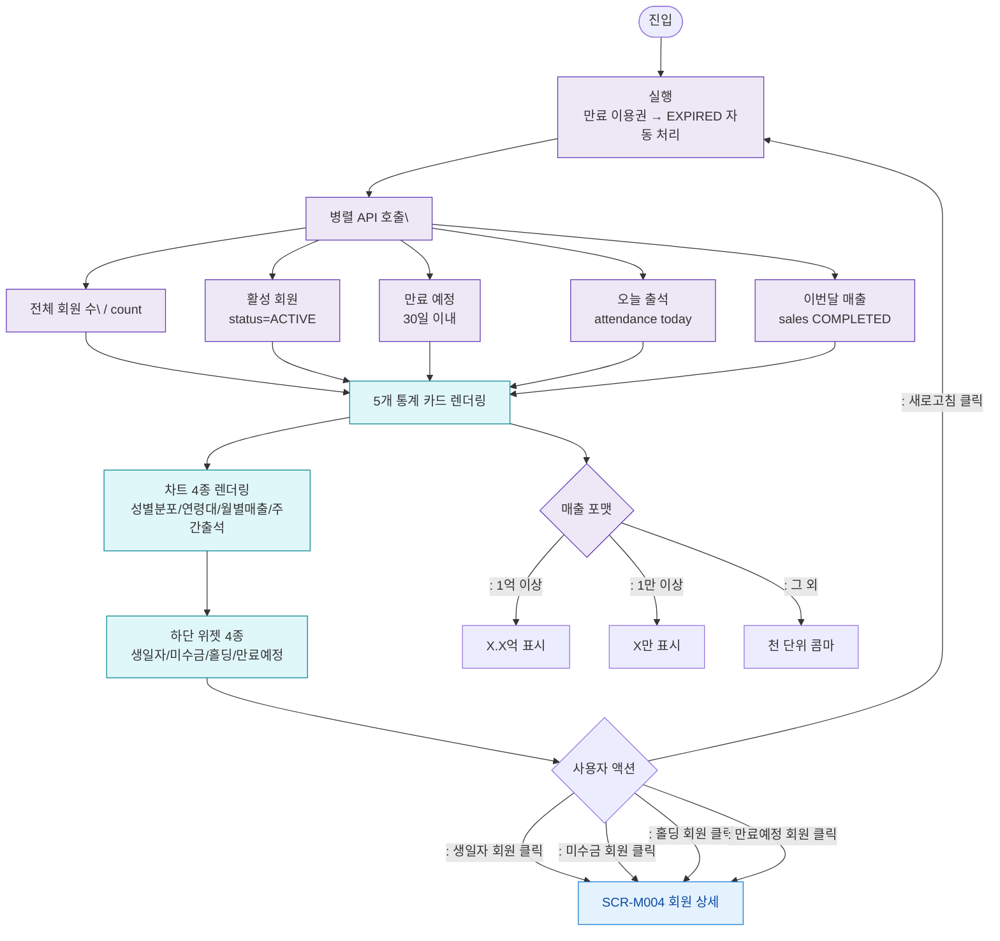

# F2 메인 인터랙션 플로우 — SCR-090 본사 대시보드

## 엣지 설명

| 출발 | 도착 | 조건 |
|------|------|------|
| UserAction | | 새로고침 버튼 클릭 |
| 생일자 위젯 | SCR-M004 | 회원명 클릭 |
| 미수금 위젯 | SCR-M004 | 회원명 클릭 |
| 홀딩 위젯 | SCR-M004 | 회원명 클릭 |
| 만료예정 위젯 | SCR-M004 | 회원명 클릭 |
| 매출 포맷 | X.X억 | 1억 이상 |
| 매출 포맷 | X만 | 1만~1억 미만 |
| 매출 포맷 | 천 단위 콤마 | 1만 미만 |

## TC 후보

| TC ID | 타입 | Given | When | Then |
|-------|:----:|-------|------|------|
| TC-090-001 | P0 positive | 로그인 성공 | 대시보드 자동 이동 | 통계 카드 5개 + 차트 4개 + 위젯 4개 |
| TC-090-002 | P1 positive | 대시보드 표시 중 | 새로고침 클릭 | + 전체 재조회 |
| TC-090-003 | P1 positive | 생일자 존재 | 회원명 클릭 | SCR-M004 이동 |
| TC-090-007 | P1 positive | 월 매출 1.5억 | 카드 확인 | "1.5억원" 표시 |
| TC-090-008 | P1 positive | 월 매출 3200만 | 카드 확인 | "3,200만원" 표시 |
| TC-090-009 | P2 positive | 회원 0명 | 페이지 진입 | 각 위젯 빈 상태 |
| TC-090-010 | P1 positive | 만료 이용권 회원 존재 | 새로고침 | 상태 EXPIRED 자동 처리 |
