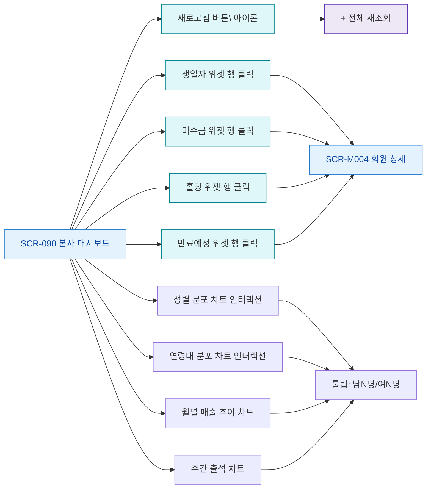

# F3 버튼/액션 매핑 — SCR-090 본사 대시보드

## TC 후보

| TC ID | 타입 | Given | When | Then |
|-------|:----:|-------|------|------|
| TC-090-002 | P1 positive | 대시보드 표시 | 새로고침 버튼 | 데이터 재조회 |
| TC-090-003 | P1 positive | 생일자 존재 | 위젯 행 클릭 | 회원 상세 이동 |
| TC-090-004 | P1 positive | 미수금 회원 존재 | 위젯 행 클릭 | 회원 상세 이동 |
| TC-090-005 | P1 positive | 만료예정 D-7 | 위젯 확인 | D-7 라벨 표시 |
