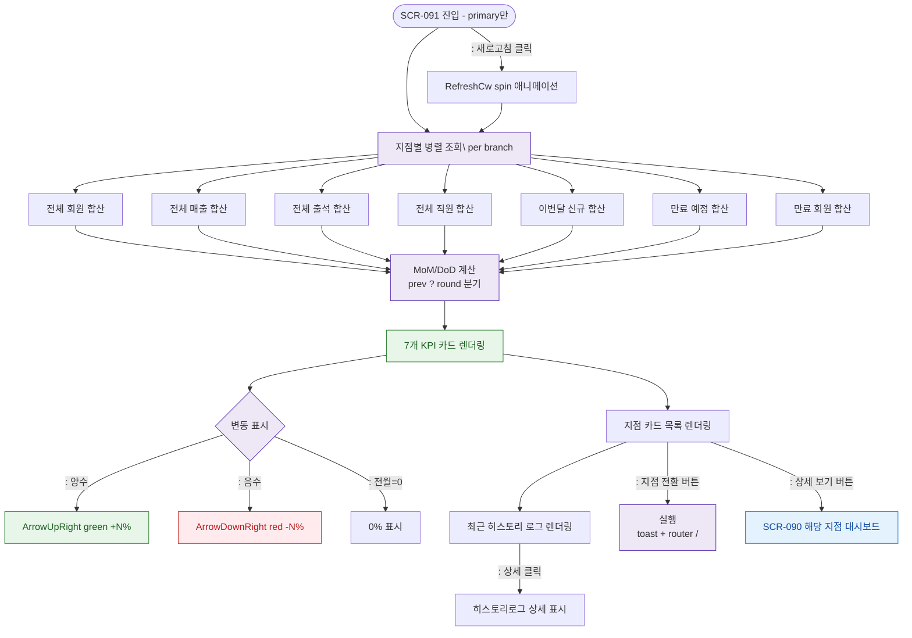

# F2 메인 인터랙션 플로우 — SCR-091 슈퍼 대시보드

## TC 후보

| TC ID | 타입 | Given | When | Then |
|-------|:----:|-------|------|------|
| TC-091-003 | P1 positive | 전월 대비 회원 증가 | KPI 확인 | ArrowUpRight green +12% |
| TC-091-004 | P1 positive | 전월 대비 출석 감소 | KPI 확인 | ArrowDownRight red -3% |
| TC-091-005 | P1 positive | 전월 매출 0 | MoM 계산 | 0% 표시 |
| TC-091-006 | P0 positive | 강남점 카드 | 전환 버튼 | toast + / 이동 |
| TC-091-007 | P1 positive | 강남점 카드 | 상세 버튼 | 강남점 대시보드 이동 |
| TC-091-010 | P1 positive | 새로고침 클릭 | 아이콘 확인 | RefreshCw spin 애니메이션 |
