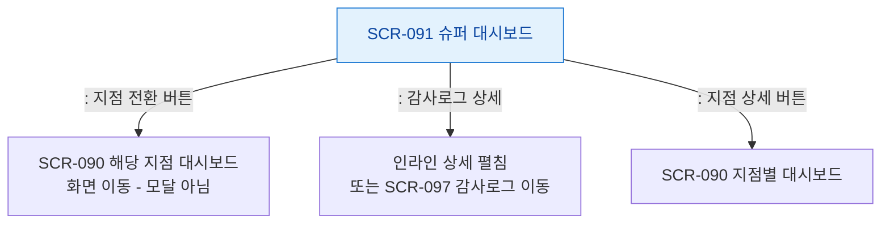

# F5 모달 트리거 트리 — SCR-091 슈퍼 대시보드

```mermaid
flowchart TD
  SCR_091[SCR-091 슈퍼 대시보드]

  SCR_091 -->|": 지점 전환 버튼"|NavDash[SCR-090 해당 지점 대시보드\n화면 이동 - 모달 아님]
  SCR_091 -->|": 감사로그 상세"|AuditInline[인라인 상세 펼침\n또는 SCR-097 감사로그 이동]
  SCR_091 -->|": 지점 상세 버튼"|NavBranch[SCR-090 지점별 대시보드]

  classDef screen fill:#E3F2FD,stroke:#1976D2,color:#0D47A1
  classDef info fill:#E0F7FA,stroke:#00838F

  class SCR_091 screen
```

## TC 후보

| TC ID | 타입 | Given | When | Then |
|-------|:----:|-------|------|------|
| TC-091-F5-001 | P1 positive | 지점 카드 표시 | 상세 버튼 | SCR-090 이동 (모달 없음) |
