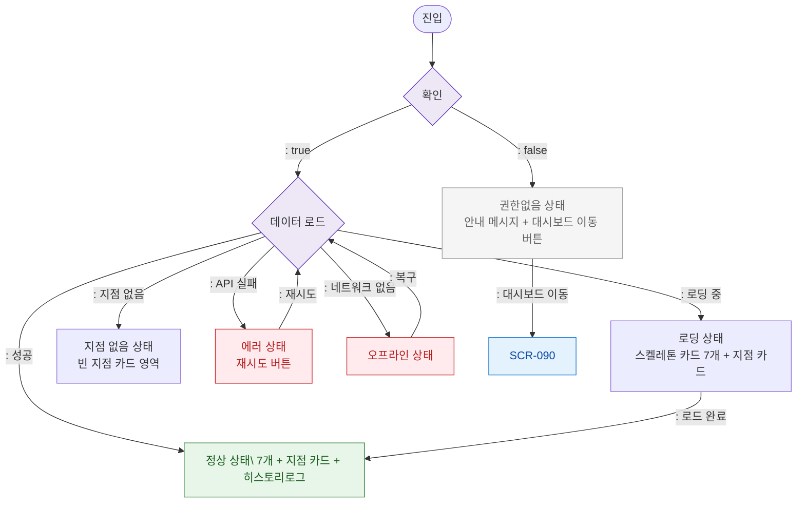

# F6 상태별 화면 플로우 — SCR-091 슈퍼 대시보드

## TC 후보

| TC ID | 타입 | Given | When | Then |
|-------|:----:|-------|------|------|
| TC-091-001 | P0 positive | | 진입 | 정상 상태 |
| TC-091-002 | P0 negative | | 진입 | 권한없음 안내 |
| TC-091-F6-001 | P1 negative | API 실패 | 데이터 로드 | 에러 상태 + 재시도 |
