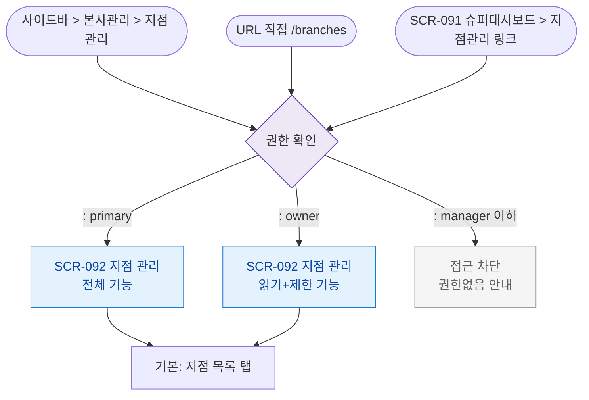

# F1 진입 플로우 — SCR-092 지점 관리

## TC 후보

| TC ID | 타입 | Given | When | Then |
|-------|:----:|-------|------|------|
| TC-092-001 | P0 positive | primary 로그인 | /branches 진입 | 통계 카드 4개 + 지점 테이블 |
| TC-092-F1-001 | P0 negative | manager 로그인 | /branches 진입 | 접근 차단 |
