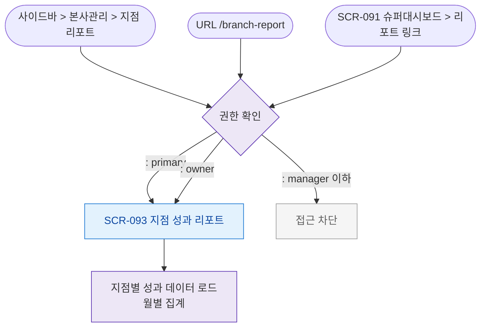

# F1 진입 플로우 — SCR-093 지점 성과 리포트

## TC 후보

| TC ID | 타입 | Given | When | Then |
|-------|:----:|-------|------|------|
| TC-093-F1-001 | P0 positive | primary | /branch-report 진입 | 지점별 성과 테이블 + 차트 |
