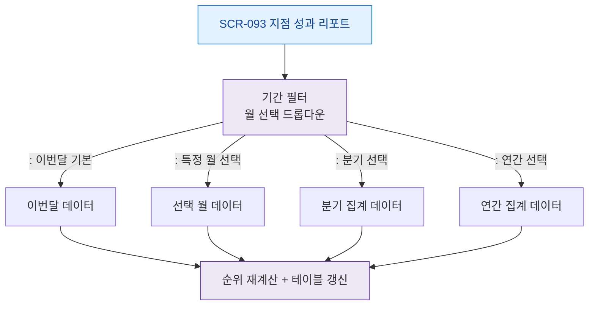

# F4 필터/검색 플로우 — SCR-093 지점 성과 리포트

```mermaid
flowchart TD
  SCR_093[SCR-093 지점 성과 리포트] --> PeriodFilter[기간 필터\n월 선택 드롭다운]

  PeriodFilter -->|": 이번달 기본"|MonthData[이번달 데이터]
  PeriodFilter -->|": 특정 월 선택"|SelectedMonthData[선택 월 데이터]
  PeriodFilter -->|": 분기 선택"|QuarterData[분기 집계 데이터]
  PeriodFilter -->|": 연간 선택"|YearData[연간 집계 데이터]

  MonthData & SelectedMonthData & QuarterData & YearData --> RankRecalc[순위 재계산 + 테이블 갱신]

  classDef screen fill:#E3F2FD,stroke:#1976D2,color:#0D47A1
  classDef system fill:#EDE7F6,stroke:#5E35B2

  class SCR_093 screen
  class PeriodFilter,RankRecalc system
```

## TC 후보

| TC ID | 타입 | Given | When | Then |
|-------|:----:|-------|------|------|
| TC-093-F4-001 | P1 positive | 리포트 표시 | 3월 선택 | 3월 데이터로 갱신 + 순위 재계산 |
