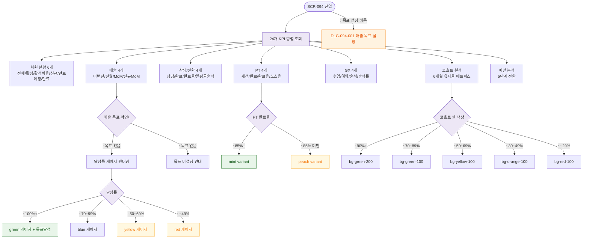

# F2 메인 인터랙션 플로우 — SCR-094 KPI 대시보드

## TC 후보

| TC ID | 타입 | Given | When | Then |
|-------|:----:|-------|------|------|
| TC-094-004 | P1 positive | 매출 > 목표 | 게이지 확인 | green + "목표 달성!" |
| TC-094-006 | P1 positive | PT 완료율 90% | 확인 | mint variant |
| TC-094-007 | P1 positive | PT 완료율 80% | 확인 | peach variant |
| TC-094-008 | P1 positive | 코호트 유지율 92% | 셀 확인 | bg-green-200 |
| TC-094-009 | P1 positive | 코호트 유지율 35% | 셀 확인 | bg-orange-100 |
| TC-094-010 | P1 positive | 퍼널 5단계 | 바 확인 | 첫 단계 100% 기준 비례 |
