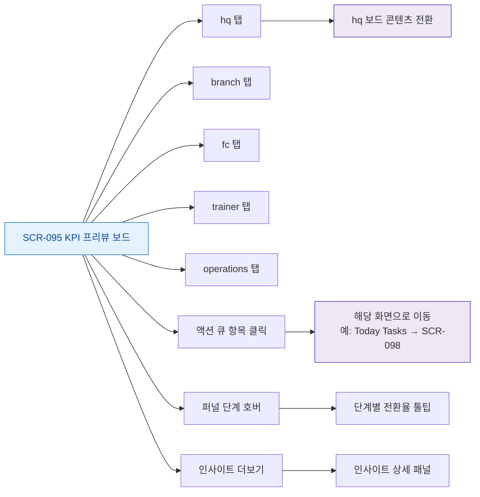

# F3 버튼/액션 매핑 — SCR-095 KPI 프리뷰 보드

## TC 후보

| TC ID | 타입 | Given | When | Then |
|-------|:----:|-------|------|------|
| TC-095-F3-001 | P1 positive | branch 탭 활성 | Today Tasks 액션 클릭 | SCR-098 이동 |
