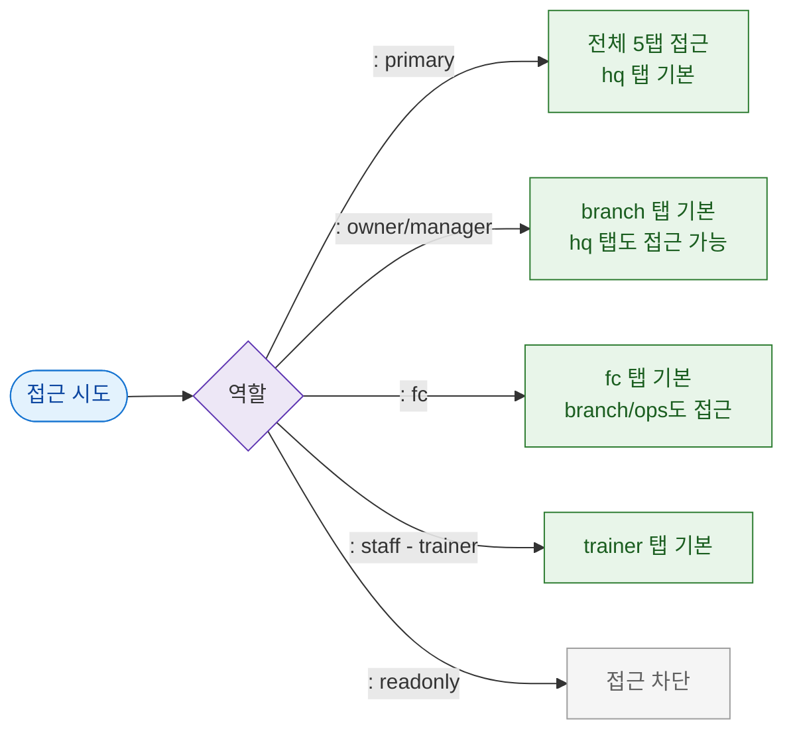

# F7 권한(RBAC) 분기 플로우 — SCR-095 KPI 센터

## TC 후보

| TC ID | 타입 | Given | When | Then |
|-------|:----:|-------|------|------|
| TC-095-F7-001 | P1 positive | fc | /kpi-preview | fc 탭 기본 + 5탭 모두 접근 가능 |
