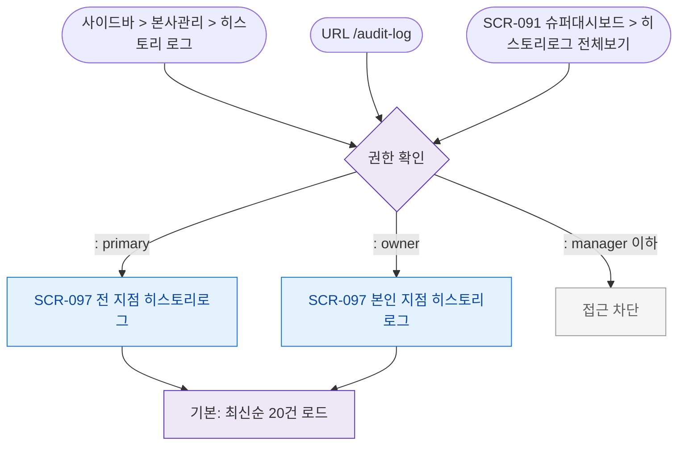

# F1 진입 플로우 — SCR-097 히스토리 로그

```mermaid
flowchart TD
  E1([사이드바 > 본사관리 > 히스토리 로그]) --> AuthCheck{권한 확인}
  E2([URL /audit-log]) --> AuthCheck
  E3([SCR-091 슈퍼대시보드 > 히스토리로그 전체보기]) --> AuthCheck

  AuthCheck -->|": primary"|SCR_097_Full[SCR-097 전 지점 히스토리로그]
  AuthCheck -->|": owner"|SCR_097_Branch[SCR-097 본인 지점 히스토리로그]
  AuthCheck -->|": manager 이하"|Blocked[접근 차단]

  SCR_097_Full & SCR_097_Branch --> DefaultLoad[기본: 최신순 20건 로드]

  classDef screen fill:#E3F2FD,stroke:#1976D2,color:#0D47A1
  classDef system fill:#EDE7F6,stroke:#5E35B2
  classDef rbacBlocked fill:#F5F5F5,stroke:#9E9E9E,color:#616161

  class SCR_097_Full,SCR_097_Branch screen
  class AuthCheck,DefaultLoad system
  class Blocked rbacBlocked
```

## TC 후보

| TC ID | 타입 | Given | When | Then |
|-------|:----:|-------|------|------|
| TC-097-001 | P0 positive | primary | /audit-log | 최신순 로그 20건/페이지 |
