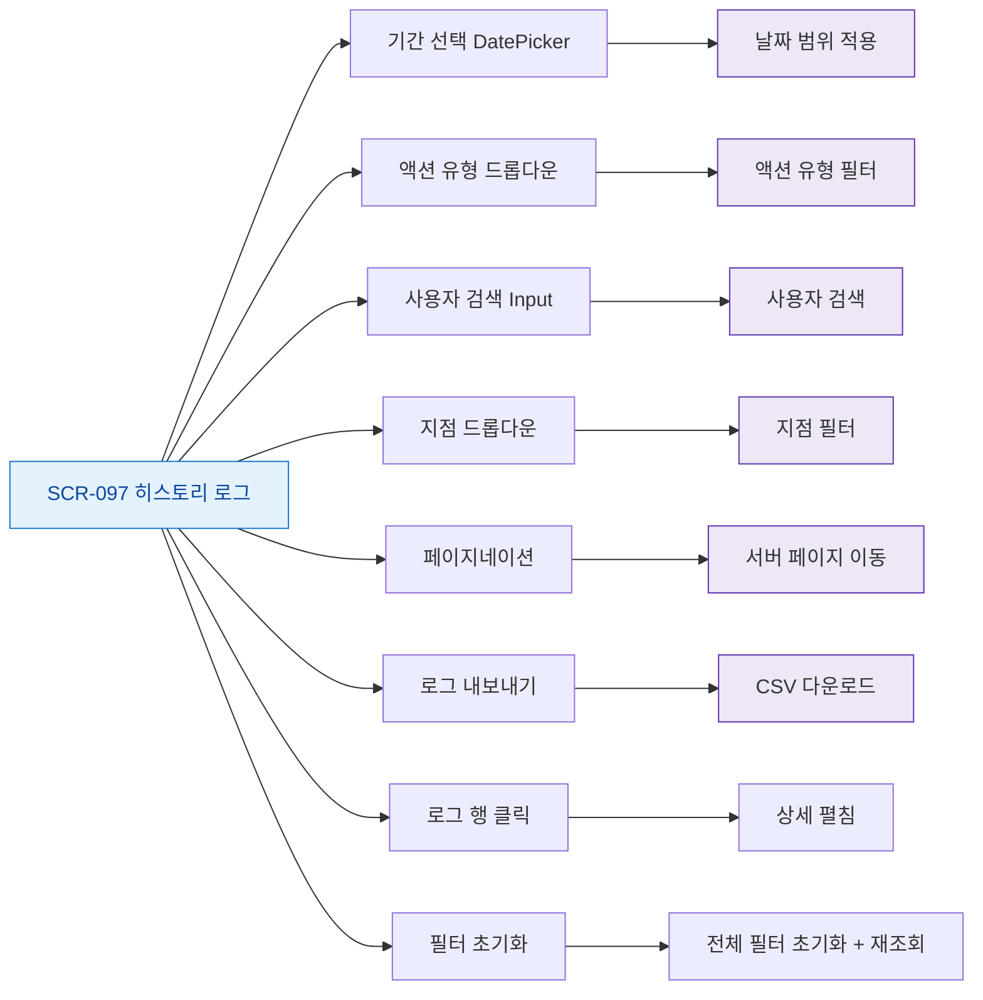

# F3 버튼/액션 매핑 — SCR-097 히스토리 로그

```mermaid
flowchart LR
  SCR_097[SCR-097 히스토리 로그]

  SCR_097 --> BTN_DATE[기간 선택 DatePicker]
  SCR_097 --> BTN_ACTION[액션 유형 드롭다운]
  SCR_097 --> BTN_USER[사용자 검색 Input]
  SCR_097 --> BTN_BRANCH[지점 드롭다운]
  SCR_097 --> BTN_PAGE[페이지네이션]
  SCR_097 --> BTN_EXPORT[로그 내보내기]
  SCR_097 --> BTN_ROW[로그 행 클릭]
  SCR_097 --> BTN_RESET[필터 초기화]

  BTN_DATE --> ACT_DATE[날짜 범위 적용]
  BTN_ACTION --> ACT_ACTION[액션 유형 필터]
  BTN_USER --> ACT_USER[사용자 검색]
  BTN_BRANCH --> ACT_BRANCH[지점 필터]
  BTN_PAGE --> ACT_PAGE[서버 페이지 이동]
  BTN_EXPORT --> ACT_EXPORT[CSV 다운로드]
  BTN_ROW --> ACT_DETAIL[상세 펼침]
  BTN_RESET --> ACT_RESET[전체 필터 초기화 + 재조회]

  classDef screen fill:#E3F2FD,stroke:#1976D2,color:#0D47A1
  classDef system fill:#EDE7F6,stroke:#5E35B2

  class SCR_097 screen
  class ACT_DATE,ACT_ACTION,ACT_USER,ACT_BRANCH,ACT_PAGE,ACT_EXPORT system
```

## TC 후보

| TC ID | 타입 | Given | When | Then |
|-------|:----:|-------|------|------|
| TC-097-F3-001 | P2 positive | 필터 적용 중 | 초기화 버튼 | 전체 필터 리셋 + 재조회 |
