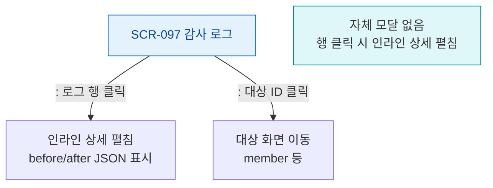

# F5 모달 트리거 트리 — SCR-097 감사 로그

```mermaid
flowchart TD
  SCR_097[SCR-097 감사 로그]
  Note[자체 모달 없음\n행 클릭 시 인라인 상세 펼침]

  SCR_097 -->|": 로그 행 클릭"|InlineDetail[인라인 상세 펼침\nbefore/after JSON 표시]
  SCR_097 -->|": 대상 ID 클릭"|NavTarget[대상 화면 이동\nmember 등]

  classDef screen fill:#E3F2FD,stroke:#1976D2,color:#0D47A1
  classDef info fill:#E0F7FA,stroke:#00838F

  class SCR_097 screen
  class Note info
```

## TC 후보

| TC ID | 타입 | Given | When | Then |
|-------|:----:|-------|------|------|
| TC-097-F5-001 | P2 positive | 로그 행 | 클릭 | 인라인 상세 펼침 (before/after) |
