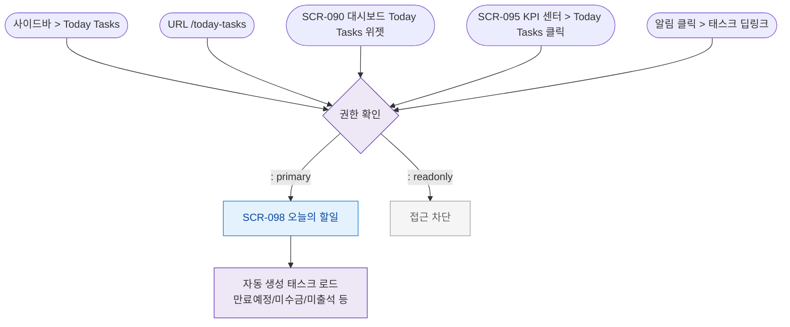

# F1 진입 플로우 — SCR-098 오늘의 할일

```mermaid
flowchart TD
  E1([사이드바 > Today Tasks]) --> AuthCheck{권한 확인}
  E2([URL /today-tasks]) --> AuthCheck
  E3([SCR-090 대시보드 Today Tasks 위젯]) --> AuthCheck
  E4([SCR-095 KPI 센터 > Today Tasks 클릭]) --> AuthCheck
  E5([알림 클릭 > 태스크 딥링크]) --> AuthCheck

  AuthCheck -->|": primary"|SCR_098[SCR-098 오늘의 할일]
  AuthCheck -->|": readonly"|Blocked[접근 차단]

  SCR_098 --> AutoGen[자동 생성 태스크 로드\n만료예정/미수금/미출석 등]

  classDef screen fill:#E3F2FD,stroke:#1976D2,color:#0D47A1
  classDef system fill:#EDE7F6,stroke:#5E35B2
  classDef rbacBlocked fill:#F5F5F5,stroke:#9E9E9E,color:#616161

  class SCR_098 screen
  class AuthCheck,AutoGen system
  class Blocked rbacBlocked
```

## TC 후보

| TC ID | 타입 | Given | When | Then |
|-------|:----:|-------|------|------|
| TC-098-001 | P0 positive | manager | /today-tasks | 자동 생성 + 수동 태스크 목록 |
