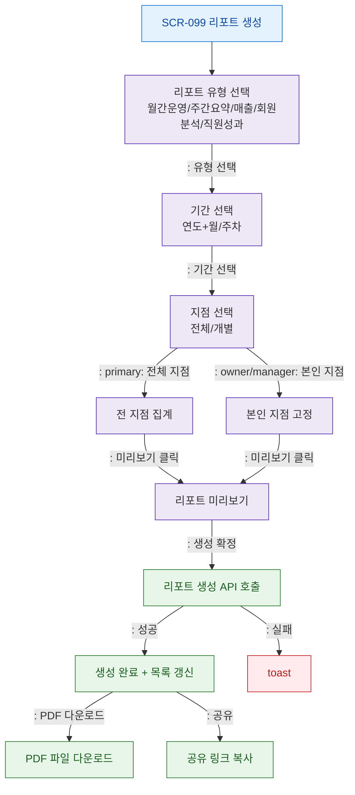

# F2 메인 인터랙션 플로우 — SCR-099 리포트 생성

## TC 후보

| TC ID | 타입 | Given | When | Then |
|-------|:----:|-------|------|------|
| TC-099-002 | P1 positive | 월간운영 선택 + 기간 선택 | 생성 확정 | 리포트 생성 + 목록 추가 |
| TC-099-003 | P1 positive | 생성 완료 상태 | PDF 다운로드 클릭 | PDF 파일 다운로드 |
