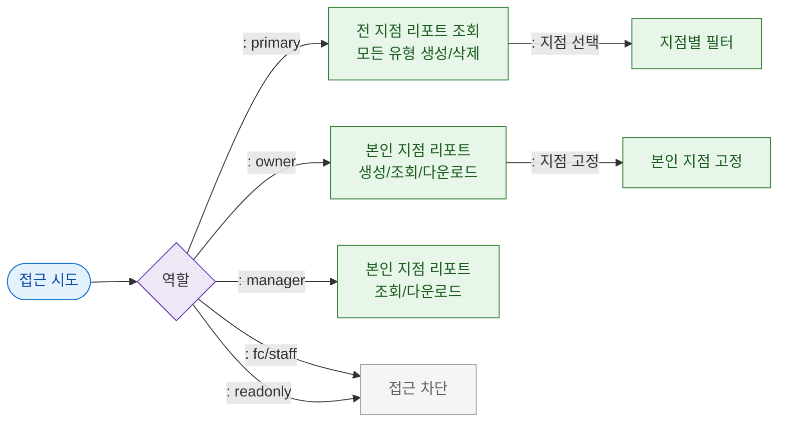

# F7 권한(RBAC) 분기 플로우 — SCR-099 리포트 생성

```mermaid
flowchart LR
  Entry([접근 시도]) --> Role{역할}

  Role -->|": primary"|PrimaryView[전 지점 리포트 조회\n모든 유형 생성/삭제]
  Role -->|": owner"|OwnerView[본인 지점 리포트\n생성/조회/다운로드]
  Role -->|": manager"|ManagerView[본인 지점 리포트\n조회/다운로드]
  Role -->|": fc/staff"|Blocked[접근 차단]
  Role -->|": readonly"|Blocked

  PrimaryView -->|": 지점 선택"|BranchSelect[지점별 필터]
  OwnerView -->|": 지점 고정"|OwnBranch[본인 지점 고정]

  classDef screen fill:#E3F2FD,stroke:#1976D2,color:#0D47A1
  classDef system fill:#EDE7F6,stroke:#5E35B2
  classDef success fill:#E8F5E9,stroke:#2E7D32,color:#1B5E20
  classDef rbacBlocked fill:#F5F5F5,stroke:#9E9E9E,color:#616161

  class Entry screen
  class Role system
  class PrimaryView,OwnerView,ManagerView,BranchSelect,OwnBranch success
  class Blocked rbacBlocked
```

## TC 후보

| TC ID | 타입 | Given | When | Then |
|-------|:----:|-------|------|------|
| TC-099-F7-001 | P1 negative | fc 역할 | 리포트 생성 메뉴 진입 시도 | 접근 차단 403 |
