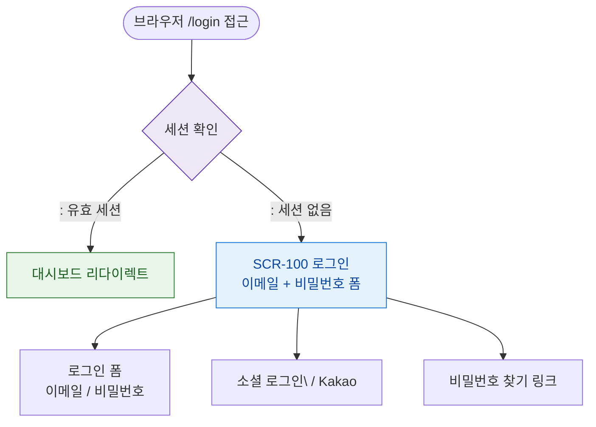

## 다이어그램

```mermaid
flowchart TD
    Entry([브라우저 /login 접근]) --> SessionCheck{세션 확인}
    SessionCheck -->|": 유효 세션"|Dashboard[대시보드 리다이렉트]
    SessionCheck -->|": 세션 없음"|SCR100[SCR-100 로그인\n이메일 + 비밀번호 폼]

    SCR100 --> LoginForm[로그인 폼\n이메일 / 비밀번호]
    SCR100 --> SocialLogin[소셜 로그인\ / Kakao]
    SCR100 --> ForgotPw[비밀번호 찾기 링크]

    classDef screen fill:#E3F2FD,stroke:#1976D2,color:#0D47A1
    classDef success fill:#E8F5E9,stroke:#2E7D32,color:#1B5E20
    classDef system fill:#EDE7F6,stroke:#5E35B2
    class SCR100 screen
    class Dashboard success
    class SessionCheck system
```

## TC 후보
- TC-100-001: 유효 세션 → 대시보드 리다이렉트
