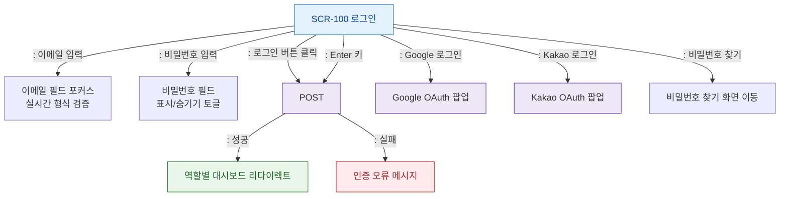

## 다이어그램

```mermaid
flowchart TD
    SCR100[SCR-100 로그인]

    SCR100 -->|": 이메일 입력"|EmailInput[이메일 필드 포커스\n실시간 형식 검증]
    SCR100 -->|": 비밀번호 입력"|PwInput[비밀번호 필드\n표시/숨기기 토글]
    SCR100 -->|": 로그인 버튼 클릭"|LoginAction[POST]
    SCR100 -->|": Google 로그인"|GoogleOAuth[Google OAuth 팝업]
    SCR100 -->|": Kakao 로그인"|KakaoOAuth[Kakao OAuth 팝업]
    SCR100 -->|": 비밀번호 찾기"|ForgotPw[비밀번호 찾기 화면 이동]
    SCR100 -->|": Enter 키"|LoginAction

    LoginAction -->|": 성공"|Redirect[역할별 대시보드 리다이렉트]
    LoginAction -->|": 실패"|LoginErr[인증 오류 메시지]

    classDef screen fill:#E3F2FD,stroke:#1976D2,color:#0D47A1
    classDef success fill:#E8F5E9,stroke:#2E7D32,color:#1B5E20
    classDef error fill:#FFEBEE,stroke:#C62828,color:#B71C1C
    classDef system fill:#EDE7F6,stroke:#5E35B2
    class SCR100 screen
    class Redirect success
    class LoginErr error
    class LoginAction,GoogleOAuth,KakaoOAuth system
```

## TC 후보
- TC-100-002: 이메일 + 비밀번호 입력 → 로그인 → 대시보드 리다이렉트
