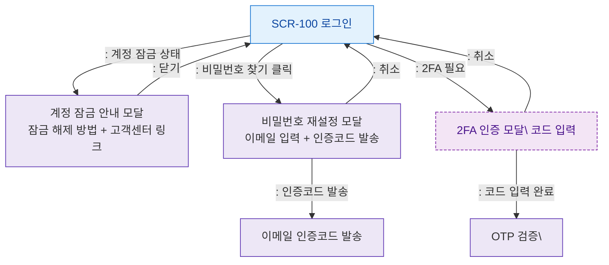

## 다이어그램

```mermaid
flowchart TD
    SCR100[SCR-100 로그인]

    SCR100 -->|": 계정 잠금 상태"|ModalLocked[계정 잠금 안내 모달\n잠금 해제 방법 + 고객센터 링크]
    SCR100 -->|": 비밀번호 찾기 클릭"|ModalForgot[비밀번호 재설정 모달\n이메일 입력 + 인증코드 발송]
    SCR100 -->|": 2FA 필요"|Modal2FA[2FA 인증 모달\ 코드 입력]

    ModalLocked -->|": 닫기"|SCR100
    ModalForgot -->|": 취소"|SCR100
    ModalForgot -->|": 인증코드 발송"|SendCode[이메일 인증코드 발송]
    Modal2FA -->|": 코드 입력 완료"|VerifyOTP[OTP 검증\]
    Modal2FA -->|": 취소"|SCR100

    classDef screen fill:#E3F2FD,stroke:#1976D2,color:#0D47A1
    classDef newFeature fill:#F3E5F5,stroke:#7B1FA2,color:#4A148C,stroke-dasharray:4 2
    classDef system fill:#EDE7F6,stroke:#5E35B2
    class SCR100 screen
    class Modal2FA newFeature
    class ModalLocked,ModalForgot system
    class SendCode,VerifyOTP system
```
