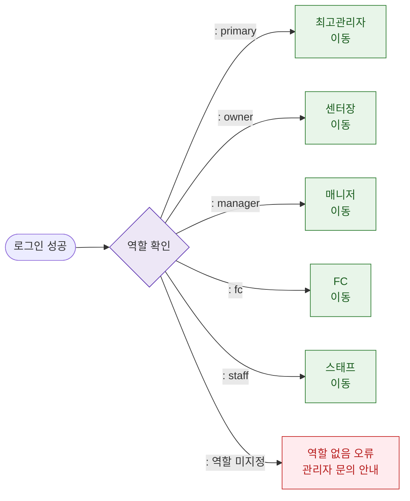

## 다이어그램

```mermaid
flowchart LR
    LoginOK([로그인 성공]) --> RoleCheck{역할 확인}

    RoleCheck -->|": primary"|P[최고관리자\n 이동]
    RoleCheck -->|": owner"|O[센터장\n 이동]
    RoleCheck -->|": manager"|M[매니저\n 이동]
    RoleCheck -->|": fc"|FC[FC\n 이동]
    RoleCheck -->|": staff"|S[스태프\n 이동]
    RoleCheck -->|": 역할 미지정"|E_NoRole[역할 없음 오류\n관리자 문의 안내]

    classDef screen fill:#E3F2FD,stroke:#1976D2,color:#0D47A1
    classDef success fill:#E8F5E9,stroke:#2E7D32,color:#1B5E20
    classDef error fill:#FFEBEE,stroke:#C62828,color:#B71C1C
    classDef system fill:#EDE7F6,stroke:#5E35B2
    class P,O,M,FC,S success
    class E_NoRole error
    class RoleCheck system
```

## 역할별 리다이렉트 경로
| 역할 | 리다이렉트 경로 |
|------|--------------|
| primary | |
| owner | |
| manager | |
| fc | |
| staff | |

## TC 후보
- TC-100-NEG-001: 역할 미지정 계정 로그인 → 오류 안내 표시
