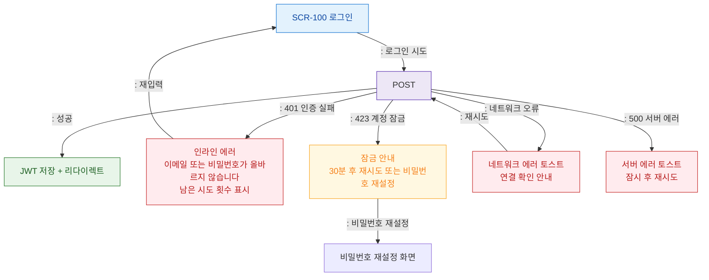

## 다이어그램

```mermaid
flowchart TD
    SCR100[SCR-100 로그인]

    SCR100 -->|": 로그인 시도"|LoginReq[POST]
    LoginReq -->|": 성공"|LoginOK[JWT 저장 + 리다이렉트]
    LoginReq -->|": 401 인증 실패"|E_Auth[인라인 에러\n이메일 또는 비밀번호가 올바르지 않습니다\n남은 시도 횟수 표시]
    LoginReq -->|": 423 계정 잠금"|E_Locked[잠금 안내\n30분 후 재시도 또는 비밀번호 재설정]
    LoginReq -->|": 네트워크 오류"|E_Network[네트워크 에러 토스트\n연결 확인 안내]
    LoginReq -->|": 500 서버 에러"|E_Server[서버 에러 토스트\n잠시 후 재시도]

    E_Auth -->|": 재입력"|SCR100
    E_Network -->|": 재시도"|LoginReq
    E_Locked -->|": 비밀번호 재설정"|ForgotPw[비밀번호 재설정 화면]

    classDef screen fill:#E3F2FD,stroke:#1976D2,color:#0D47A1
    classDef success fill:#E8F5E9,stroke:#2E7D32,color:#1B5E20
    classDef error fill:#FFEBEE,stroke:#C62828,color:#B71C1C
    classDef warning fill:#FFF8E1,stroke:#F9A825,color:#F57F17
    classDef system fill:#EDE7F6,stroke:#5E35B2
    class SCR100 screen
    class LoginOK success
    class E_Auth,E_Network,E_Server error
    class E_Locked warning
    class LoginReq system
```

## TC 후보
- TC-100-NEG-002: 5회 연속 실패 → 계정 잠금(423) → 잠금 안내 표시
