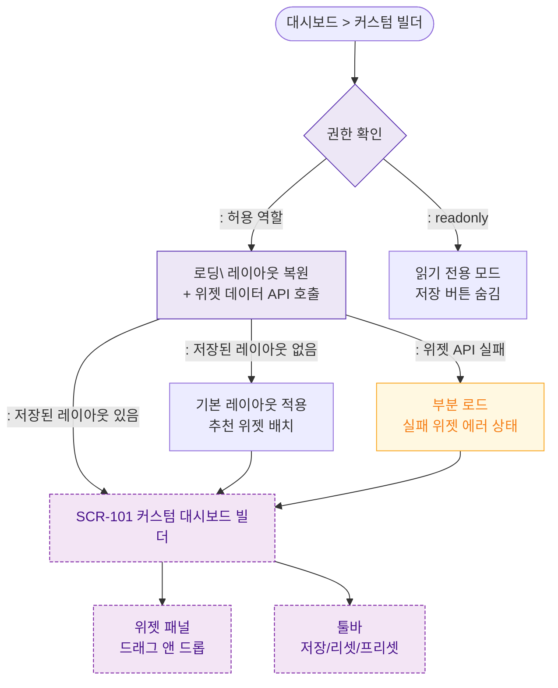

## 다이어그램

```mermaid
flowchart TD
    Sidebar([대시보드 > 커스텀 빌더]) --> Auth{권한 확인}
    Auth -->|": 허용 역할"|Loading[로딩\ 레이아웃 복원\n+ 위젯 데이터 API 호출]
    Auth -->|": readonly"|ReadOnly[읽기 전용 모드\n저장 버튼 숨김]

    Loading -->|": 저장된 레이아웃 있음"|SCR101[SCR-101 커스텀 대시보드 빌더\n]
    Loading -->|": 저장된 레이아웃 없음"|DefaultLayout[기본 레이아웃 적용\n추천 위젯 배치]
    Loading -->|": 위젯 API 실패"|PartialLoad[부분 로드\n실패 위젯 에러 상태]

    DefaultLayout --> SCR101
    PartialLoad --> SCR101

    SCR101 --> WidgetPanel[위젯 패널\n드래그 앤 드롭]
    SCR101 --> Toolbar[툴바\n저장/리셋/프리셋]

    classDef screen fill:#E3F2FD,stroke:#1976D2,color:#0D47A1
    classDef newFeature fill:#F3E5F5,stroke:#7B1FA2,color:#4A148C,stroke-dasharray:4 2
    classDef warning fill:#FFF8E1,stroke:#F9A825,color:#F57F17
    classDef system fill:#EDE7F6,stroke:#5E35B2
    class SCR101 newFeature
    class WidgetPanel,Toolbar newFeature
    class PartialLoad warning
    class Loading,Auth system
```

## TC 후보
- TC-101-001: 저장된 레이아웃 있음 → 복원된 레이아웃으로 빌더 진입
