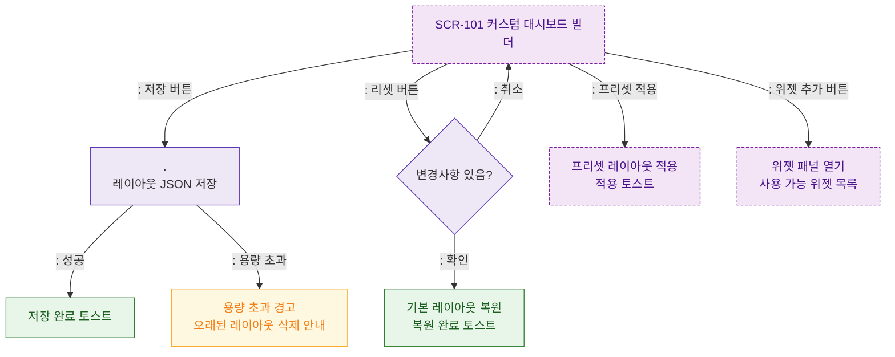

## 다이어그램

```mermaid
flowchart TD
    SCR101[SCR-101 커스텀 대시보드 빌더]

    SCR101 -->|": 저장 버튼"|SaveReq[.\n레이아웃 JSON 저장]
    SaveReq -->|": 성공"|SaveOK[저장 완료 토스트]
    SaveReq -->|": 용량 초과"|E_Storage[용량 초과 경고\n오래된 레이아웃 삭제 안내]

    SCR101 -->|": 리셋 버튼"|ResetConfirm{변경사항 있음?}
    ResetConfirm -->|": 확인"|ResetOK[기본 레이아웃 복원\n복원 완료 토스트]
    ResetConfirm -->|": 취소"|SCR101

    SCR101 -->|": 프리셋 적용"|PresetApply[프리셋 레이아웃 적용\n적용 토스트]
    SCR101 -->|": 위젯 추가 버튼"|OpenPanel[위젯 패널 열기\n사용 가능 위젯 목록]

    classDef screen fill:#E3F2FD,stroke:#1976D2,color:#0D47A1
    classDef newFeature fill:#F3E5F5,stroke:#7B1FA2,color:#4A148C,stroke-dasharray:4 2
    classDef success fill:#E8F5E9,stroke:#2E7D32,color:#1B5E20
    classDef warning fill:#FFF8E1,stroke:#F9A825,color:#F57F17
    classDef system fill:#EDE7F6,stroke:#5E35B2
    class SCR101 newFeature
    class OpenPanel,PresetApply newFeature
    class SaveOK,ResetOK success
    class E_Storage warning
    class SaveReq,ResetConfirm system
```

## TC 후보
- TC-101-003: 레이아웃 저장 버튼 → 저장 → 저장 완료 토스트
