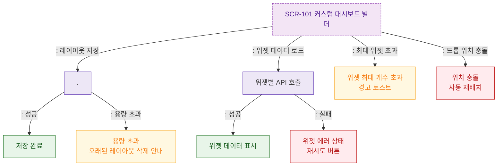

## 다이어그램

```mermaid
flowchart TD
    SCR101[SCR-101 커스텀 대시보드 빌더]

    SCR101 -->|": 레이아웃 저장"|SaveReq[.]
    SaveReq -->|": 성공"|SaveOK[저장 완료]
    SaveReq -->|": 용량 초과"|E_Storage[용량 초과\n오래된 레이아웃 삭제 안내]

    SCR101 -->|": 위젯 데이터 로드"|DataReq[위젯별 API 호출]
    DataReq -->|": 성공"|DataOK[위젯 데이터 표시]
    DataReq -->|": 실패"|E_WidgetFail[위젯 에러 상태\n재시도 버튼]

    SCR101 -->|": 최대 위젯 초과"|E_MaxWidgets[위젯 최대 개수 초과\n경고 토스트]
    SCR101 -->|": 드롭 위치 충돌"|E_Overlap[위치 충돌\n자동 재배치]

    classDef screen fill:#E3F2FD,stroke:#1976D2,color:#0D47A1
    classDef newFeature fill:#F3E5F5,stroke:#7B1FA2,color:#4A148C,stroke-dasharray:4 2
    classDef error fill:#FFEBEE,stroke:#C62828,color:#B71C1C
    classDef success fill:#E8F5E9,stroke:#2E7D32,color:#1B5E20
    classDef warning fill:#FFF8E1,stroke:#F9A825,color:#F57F17
    classDef system fill:#EDE7F6,stroke:#5E35B2
    class SCR101 newFeature
    class SaveOK,DataOK success
    class E_Storage,E_MaxWidgets warning
    class E_WidgetFail,E_Overlap error
    class SaveReq,DataReq system
```

## TC 후보
- TC-101-NEG-002: 위젯 데이터 로드 실패 → 위젯 에러 상태 + 재시도
