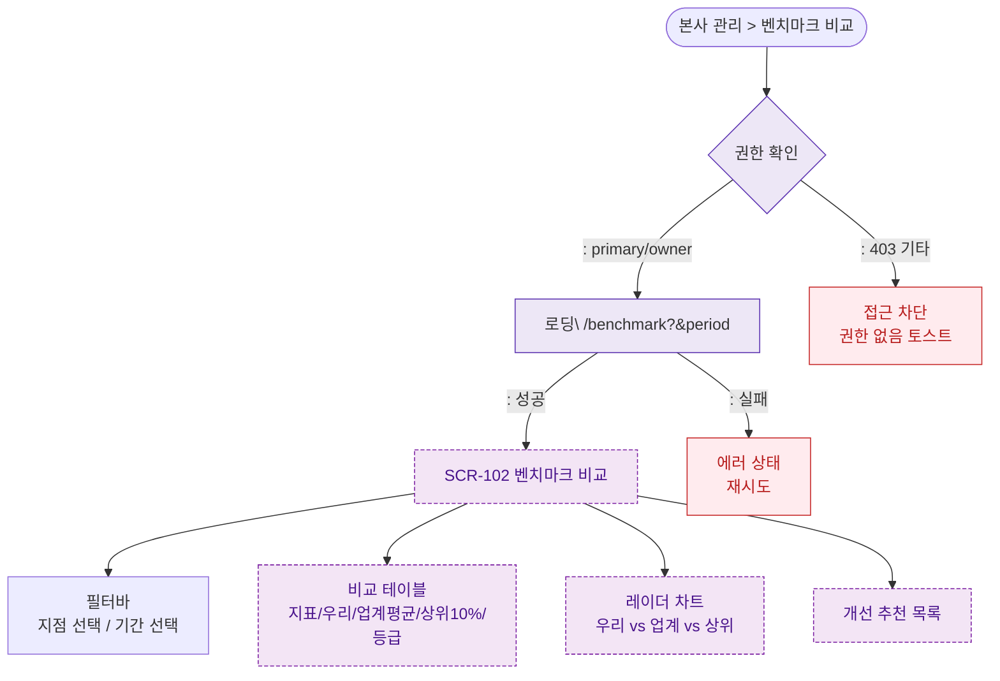

## 다이어그램

```mermaid
flowchart TD
    Sidebar([본사 관리 > 벤치마크 비교]) --> Auth{권한 확인}
    Auth -->|": primary/owner"|Loading[로딩\ /benchmark?&period]
    Auth -->|": 403 기타"|Blocked[접근 차단\n권한 없음 토스트]

    Loading -->|": 성공"|SCR102[SCR-102 벤치마크 비교\n]
    Loading -->|": 실패"|ErrorState[에러 상태\n재시도]

    SCR102 --> FilterBar[필터바\n지점 선택 / 기간 선택]
    SCR102 --> CompTable[비교 테이블\n지표/우리/업계평균/상위10%/등급]
    SCR102 --> RadarChart[레이더 차트\n우리 vs 업계 vs 상위]
    SCR102 --> Suggestions[개선 추천 목록]

    classDef screen fill:#E3F2FD,stroke:#1976D2,color:#0D47A1
    classDef newFeature fill:#F3E5F5,stroke:#7B1FA2,color:#4A148C,stroke-dasharray:4 2
    classDef error fill:#FFEBEE,stroke:#C62828,color:#B71C1C
    classDef system fill:#EDE7F6,stroke:#5E35B2
    class SCR102 newFeature
    class CompTable,RadarChart,Suggestions newFeature
    class ErrorState,Blocked error
    class Loading,Auth system
```

## TC 후보
- TC-102-001: 본사 관리 > 벤치마크 비교 진입 → 비교 테이블 + 레이더 차트 표시
